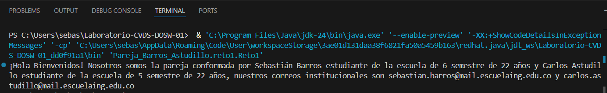
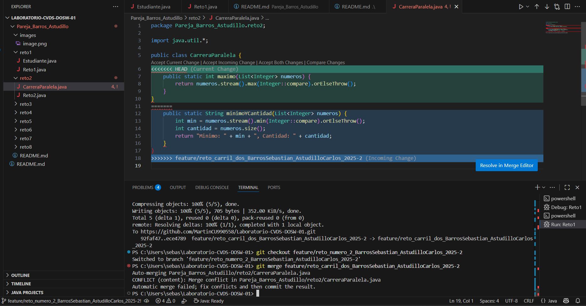
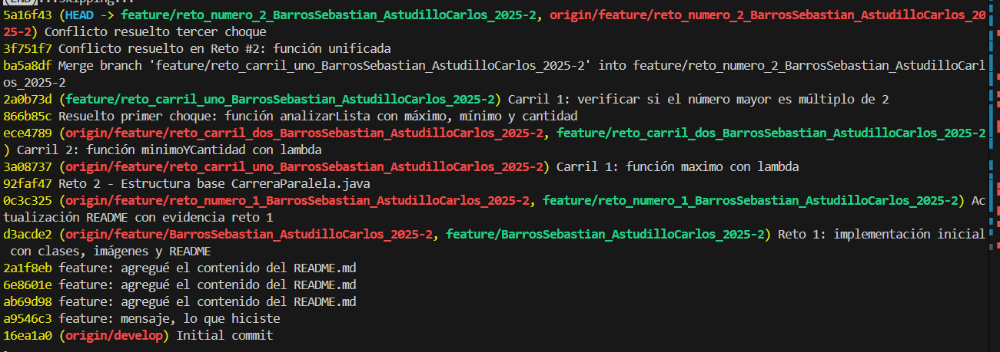
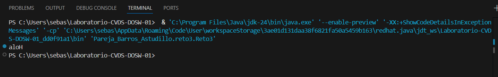
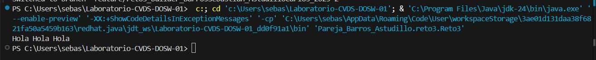
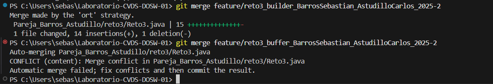
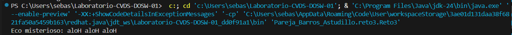
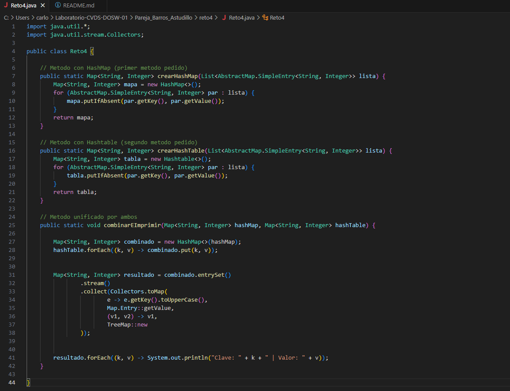

# Maratón Git 2025–2

**Integrantes:**
- Sebastian Barros
- Carlos Astudillo

**Nombre de la rama:** feature/BarrosSebastian_AstudilloCarlos_2025–2

---

# Retos Completados

Reto 1:

Evidencia: 

Reto 2:

Tuvimos problemas para trabajar juntos despues del laboratorio, asi que intente hacer la carrera por mi cuenta, en las imagenes se ve como resolvimos los conflictos.

Reto 3:

Tambien lo realizo solo una persona, pero creando ambas ramas y solucionando el conflicto del merge

funcionamiento del buffer antes del merge 

funcionamiento del builder antes del merge 

conflicto en el merge 

solucion del conflicto merge 

Reto 4:

Como venia deciendo mi compañero se nos dificulto porder organizarnos en los mismos tiempos para poder hacer los commits y merge en conjunto por ende nos dividimos las actividades, de todas formas se hizo paso a paso

Cuestionario:

1.	Cuál es la diferencia entre git merge y git rebase
Git merge combina dos ramas preservando el historial completo de ambas ramas, crea un nuevo commit de merge que tiene dos padres.
Por otro lado git rebase reescribe la historia del proyecto, es mas limpio visualmente ya que reaplica commits de una rama sobre la otra.

2.	Si dos ramas modifican la misma línea de un archivo ¿Qué sucede al hacer merge?
Hay un conflicto, git detecta que hay informacion distinta en cada rama pero no sabe como resolver el conflicto, asi que hay que corregirlo manualmente.

3.	¿Cómo puedes ver gráficamente el historial de merges y ramas en consola?

Hay varios comando, uno de ellos es git log --oneline --graph
4.	Explica la diferencia entre un commit y un push?
El commit se aplica sobre el repositorio local, mientras que el push sube los cambios al repositorio remoto en git

5.	Para que sirve git stash y git pop?
Git stash guarda cambios temporales sin hacer commit, mientras que el git pop recupera lo que se guarda con el stash

6.	Qué diferencia hay entre HashMap y HashTable?
HashMap permite null keys y multiples null values, ademas de ser no sincronizado (no seguro para threads). HashTable no permite null keys o null values pero si es sincronizado (seguro para threads)

7.	Qué ventajas tiene Collectors.toMap() frente a un bucle tradicional para llenar un mapa?
Usando stream el codigo es mas corto, conciso y esta mas optimizado. El bucle tradicional te da mas control sobre el proceso.

8.	Si usas List con objetos y luego aplicas stream().map() que tipo de operación estas haciendo?
Transformacion, ya que convierte cada objeto de la lista en otro objeto o dato.

9.	Que hace el método stream().filter() y que retorna?
Filtra elementos teniendo en cuenta una condicion y retorna solo los elementos que cumplen la condicion

10.	 Describe el paso a paso de cómo crear una rama desde develop si es una funcionalidad nueva.
Primero sincronizo mi repositorio local con el remoto con fetch y pull estando en la rama develop, despues creo la nueva rama feature, hago un commit con un mensaje descriptivo de que hice y por ultimo subo la rama con push al git.

11.	¿Cuál es la diferencia entre crear una rama con git branch y con git checkout -b?
Con git branch solo se crea la rama nueva, no se cambia a la rama que acaba de crear por lo que despues debo hacer checkout para cambiarme, por otro lado, con checkout -b la creo y me cambia inmediatamente a la rama nueva.

12.	¿Por qué es recomendable crear ramas feature/ para nuevas funcionalidades en lugar de trabajar en main directamente?
Primero porque asi se evita arruinar el codigo principal asegurandome que el main siempre funciona, se pueden trabajar en multiples funcionalidades nuevas al tiempo, se puede hacer rollback si hay problemas

...
---