# Laboratorio-CVDS-DOSW-01
# Maratón Git 2025-2

**Integrantes:**
- Juan Pablo Caballero Castellanos
- Robinson Steven Nuñez Portela

**Nombre de la rama:** feature/CaballeroJuan_PortelaRobinson_2025-2

---

## Retos Completados

### Reto 1: Configuración y creación de rama
**Evidencia:**

**Descripción:**
El código define una clase que nos representa como estudiantes con nuestro nombre, edad, correo y semestre. Toma nuestros datos y genera un mensaje de bienvenida usando una lista de estudiantes, mostrando sus datos básicos y los correos institucionales.

## Reto 2: Carrera en Paralelo
**Evidencia:**

**Descripción:**
Se renombro reto2, luego se crearon las subramas con el fin de hacer 2 carriles en los cuales se fueron competian en una carrera pero se chocaban y cuando lo hacian se juntaban sus tareas. 

## Reto 3: El eco misterioso
**Evidencia:**
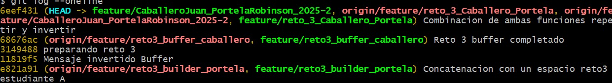
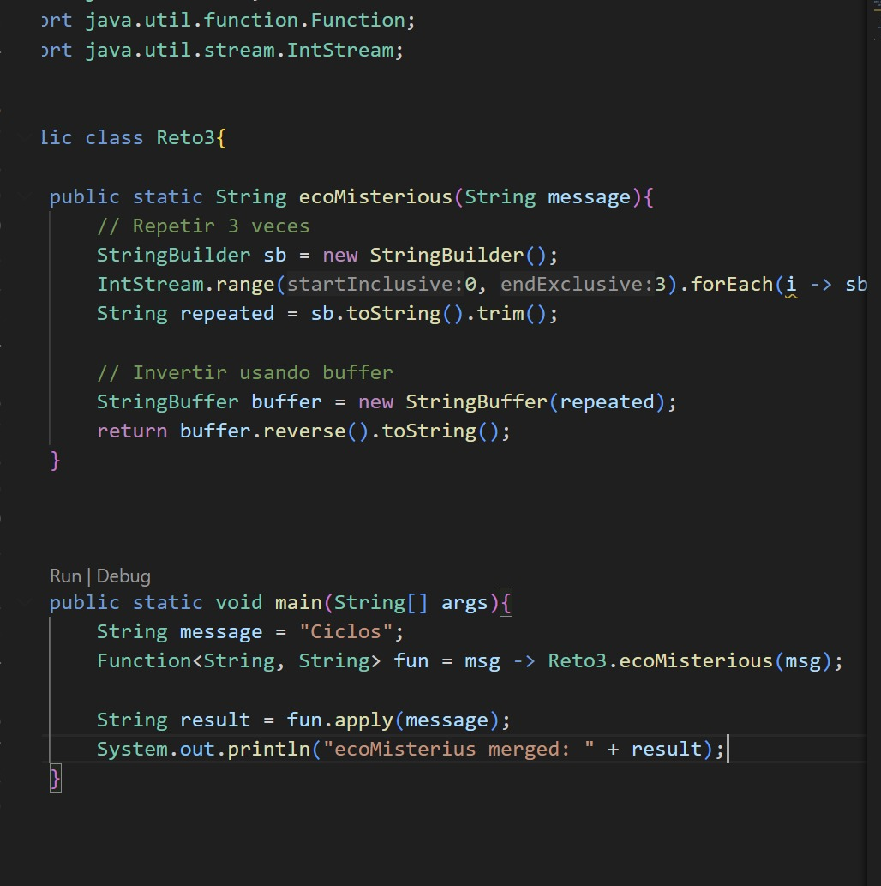
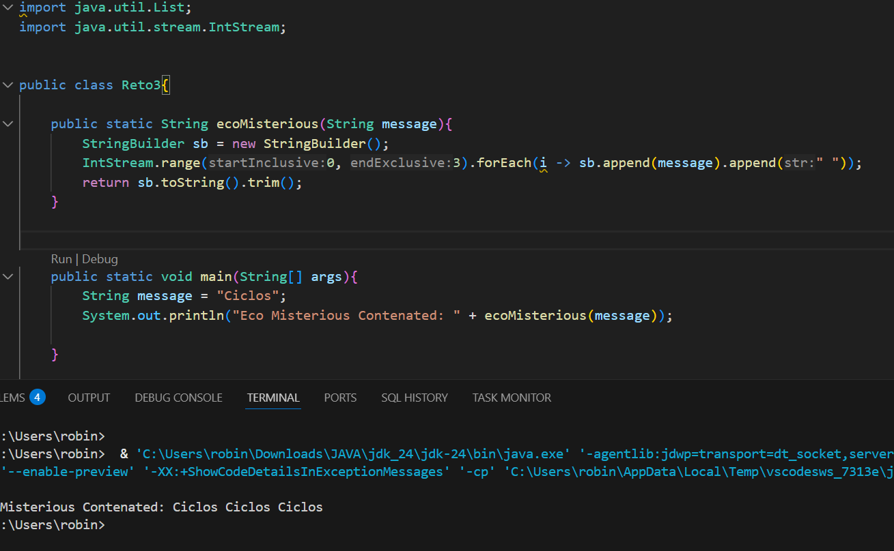
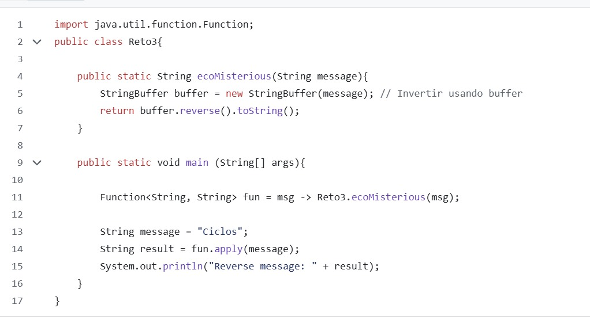

**Descripción:**
Los estudiantes A y B trabajan con un String. El A debe dar una concatencación con un espacio para el string usando StringBuilder y que se repita 3 veces, el estudiante B debe invertir el string finalmente los 2 metodos chocan y deven ser solucionados por medio de merge

## Reto 4: El tesoro de las Llaves duplicadas
**Evidencia:**
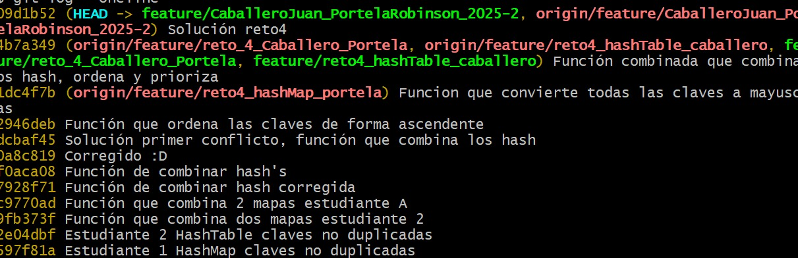
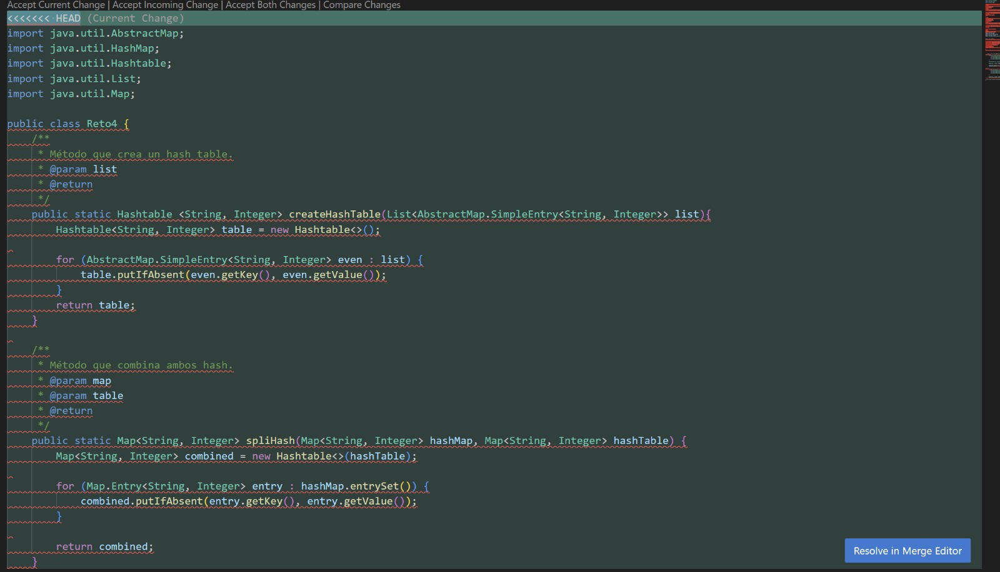
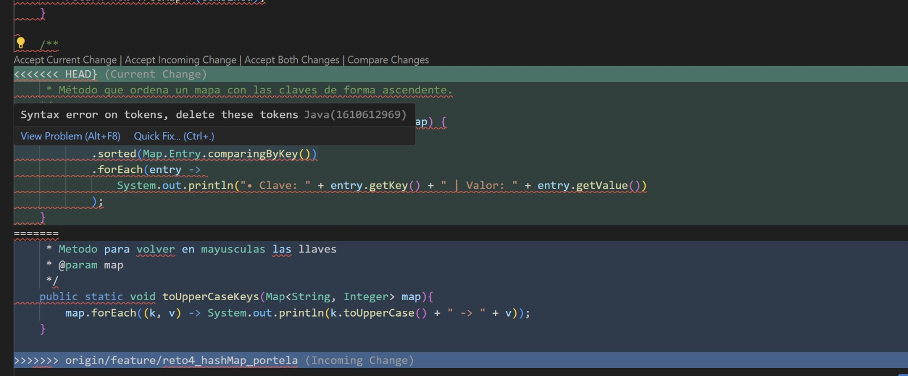
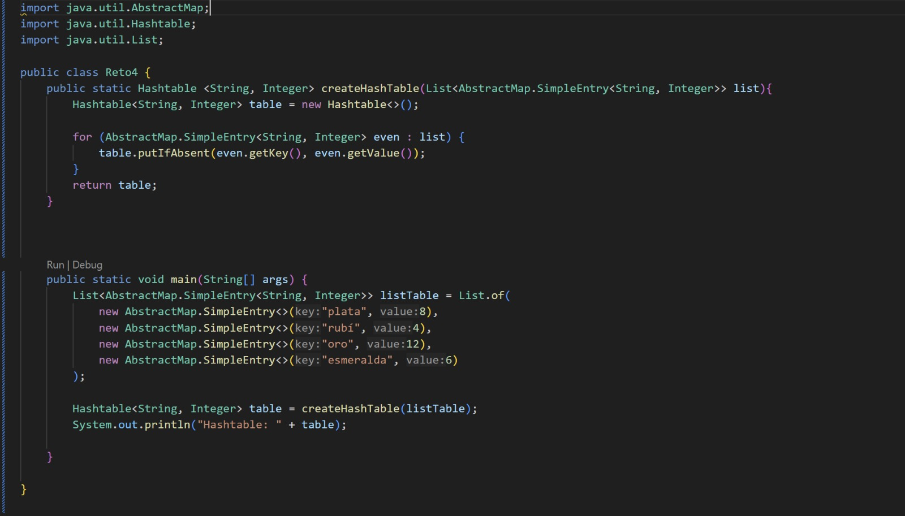
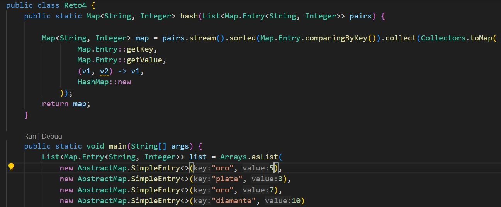

**Descripción:**
El estudiante A tuvo que realizar un HashMap en el cual debia tomar una llave y su valor y que no fuera repetido.
El estudiante B hizo lo mismo pero usando HashTable, luego cada uno hizo un metodo para combinar los hash y se realizo el primer merge para solucionar los conflictos. Continuo el estudiante A añadiendo un metodo para convertir las llaves a mayúsculas y el estudiante B hizo un metodo de orden ascendente para las llaves. Finalmente se hizo un segundo merge y se soluciono todo agrupando los métodos ya realizados para cumplir con el objetivo de la salida y darle prioridad al HashTable.

## Reto 5: Batalla de Conjuntos
**Evidencia:**

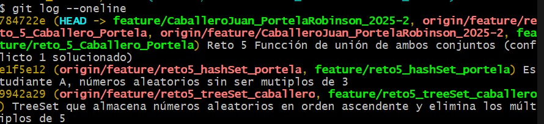
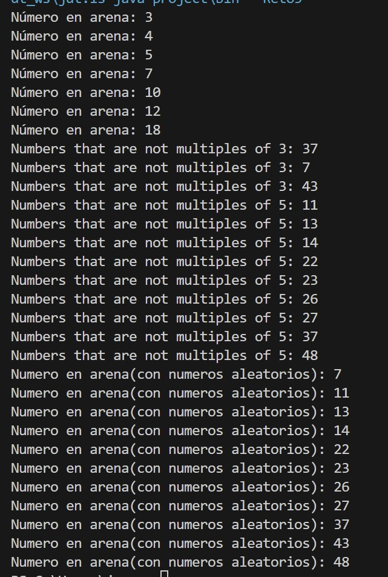
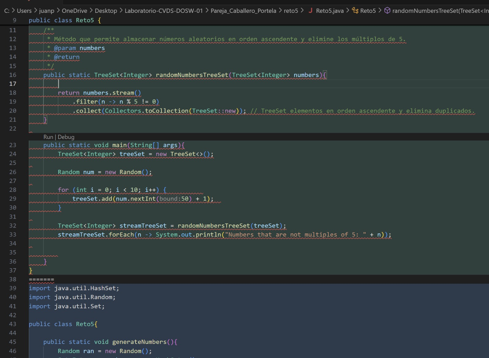
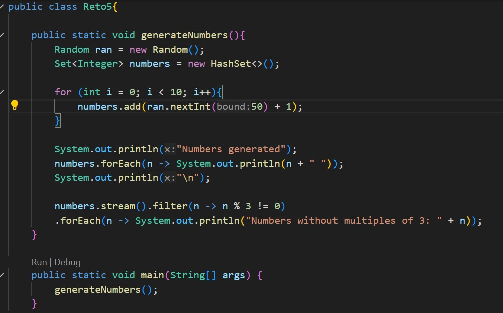

**Descripción:**
El estudiante A realizo un método usando HashSet para generar números aleatorios pero quitando los que son multiplos de 3.
El estudiante B hizo algo similar solo que uso TreeSet, que ordena los números ascendentemente y quito los multiplos de 5.
Luego se realizo el merge, para solucionarlo se creo un metodo de unión para ambos tipos de set/conjunto, pero se conviritio en un TreeMap ya que este ordena los números ascendentemente para asi lograr la salida. 

## Reto 6: La máquina de decisiones
**Evidencia:**
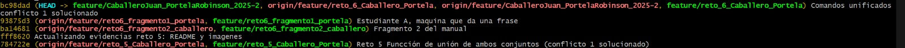
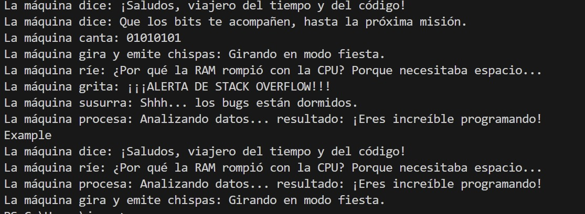
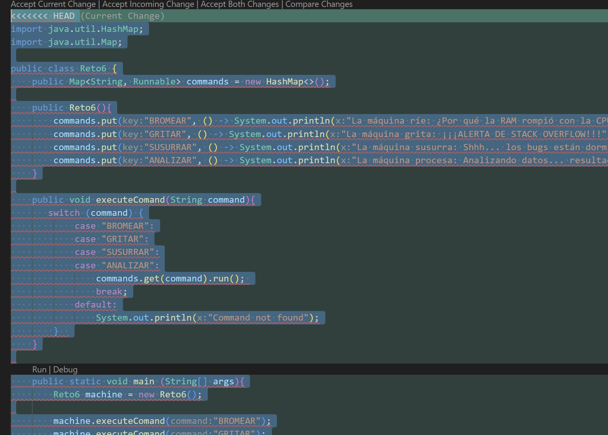
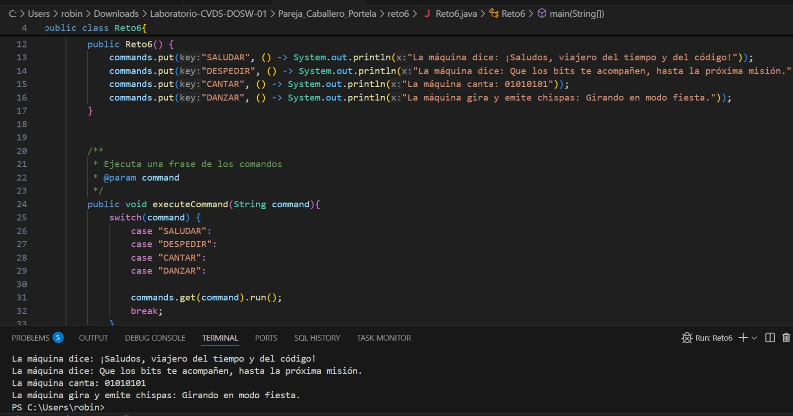

**Descripción:**
Ambos estudiantes A y B deben hacer uso de switch para que se ejecuten comandos para que impriman ciertas frases para cada uno.
Luego se deben unir los comandos de los estudiantes A y B recibiendolos en listas.