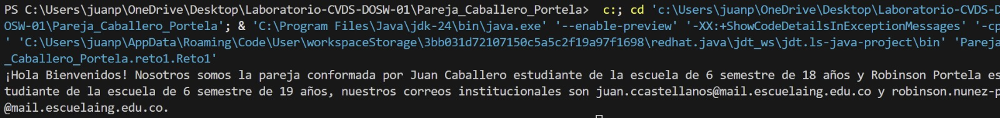
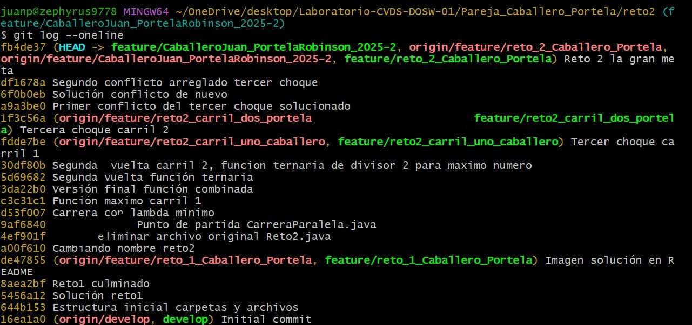
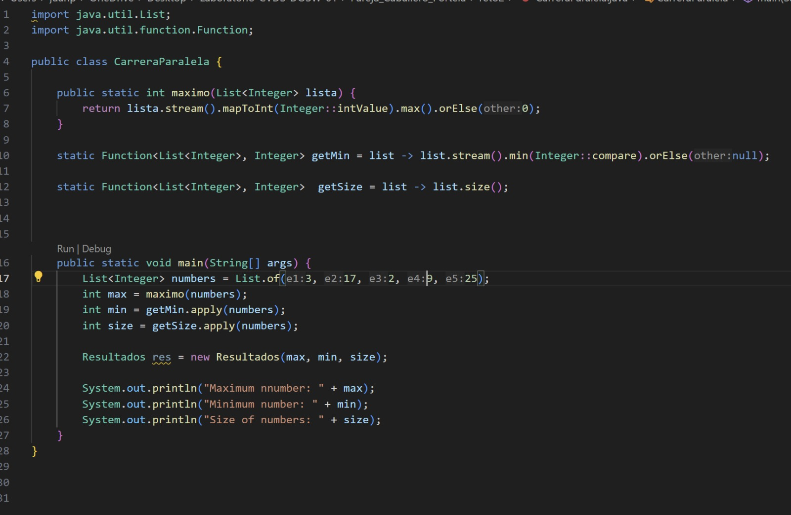
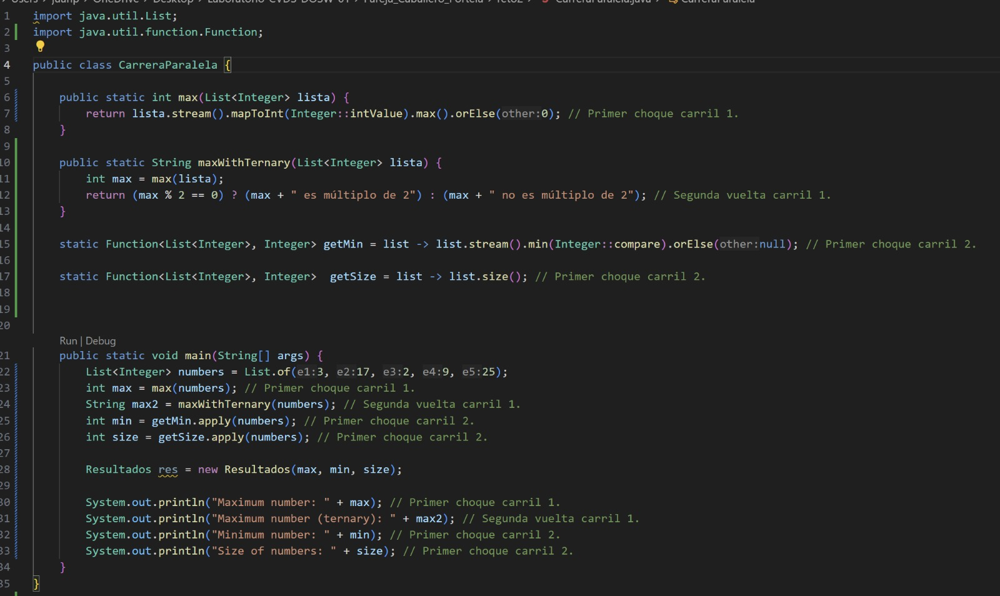

# Laboratorio-CVDS-DOSW-01
# Maratón Git 2025-2

**Integrantes:**
- Juan Pablo Caballero Castellanos
- Robinson Steven Nuñez Portela

**Nombre de la rama:** feature/CaballeroJuan_PortelaRobinson_2025-2

---

## Retos Completados

### Reto 1: Configuración y creación de rama
**Evidencia:**

**Descripción:**
El código define una clase que nos representa como estudiantes con nuestro nombre, edad, correo y semestre. Toma nuestros datos y genera un mensaje de bienvenida usando una lista de estudiantes, mostrando sus datos básicos y los correos institucionales.

## Reto 2: Carrera en Paralelo
**Evidencia:**

**Descripción:**
Se renombro reto2, luego se crearon las subramas con el fin de hacer 2 carriles en los cuales se fueron competian en una carrera pero se chocaban y cuando lo hacian se juntaban sus tareas. 