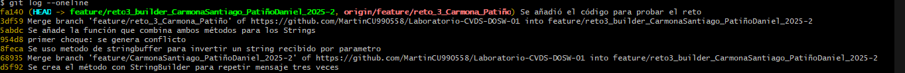
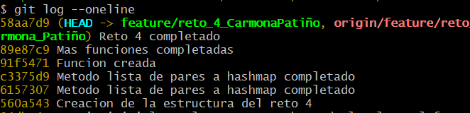
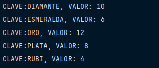
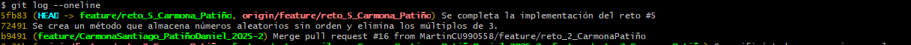
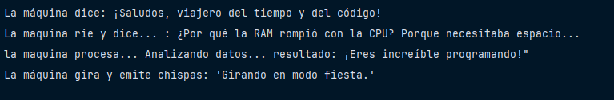

#Maraton Git 2025-2 LAB01

**Integrantes**

- Daniel Patiño
- Santiago Carmona

\*\*feature/CarmonaSantiago_PatiñoDaniel_2025-2

---

## Retos Completados

### Reto 1: La Bienvenid

**Evidencia**

### Reto 2: Carrera en Paralelo

**Evidencia**

.png>)

### Reto 3: El eco misterioso

**Evidencia**

### Reto 4: El tesoro de las Llaves duplicadas

**Evidencia**

### Reto 5: Batalla de Conjuntos

**Evidencia**

### Reto 6: La máquina de decisiones

**Evidencia**

...

---

## Preguntas teóricas

1. Cuál es la diferencia entre git merge y git rebase
   La diferencia entre git merge y git rebase está en cómo integran los cambios y cómo se refleja la historia. Con merge, se unen dos ramas creando un commit adicional que representa la fusión, manteniendo intacta la historia original y mostrando las ramificaciones tal como ocurrieron. En cambio, rebase toma los commits de una rama y los reaplica sobre otra, reescribiendo la historia para que parezca lineal, sin commits de unión. En pocas palabras: merge conserva la historia fiel, mientras que rebase la hace más limpia y ordenada.

2. Si dos ramas modifican la misma línea de un archivo ¿Qué sucede al hacer merge?

Cuando dos ramas modifican la misma línea de un archivo y luego se intenta hacer un merge, Git no sabe cuál versión elegir automáticamente. En ese caso ocurre un conflicto de merge.

Git detiene el proceso, marca el archivo en conflicto y muestra ambas versiones de la línea para que decidas cuál conservar (o si se necesita combinarlas manualmente). Solo después de resolver el conflicto y hacer un commit, el merge se completa.

3. ¿Cómo puedes ver gráficamente el historial de merges y ramas en consola?

En la consola se puede ver el historial de commits, merges y ramas de forma gráfica usando:

git log --oneline --graph –all
• --oneline → muestra cada commit en una sola línea.
• --graph → dibuja un gráfico ASCII con ramas y merges.
• --all → incluye todas las ramas, no solo la actual.

4. Explica la diferencia entre un commit y un push?
   Un commit y un push son pasos distintos en Git:

Commit: guarda los cambios en el repositorio local, creando un punto en la historia con un mensaje que describe lo que se hizo. Es como tomar una “foto” del trabajo, pero esa foto solo existe en la máquina.

Push: envía los commits del repositorio local hacia el repositorio remoto (por ejemplo, GitHub, GitLab). Es el paso que comparte el trabajo con los demás.

5. Para que sirve git stash y git pop?
   git stash se utiliza para guardar temporalmente los cambios en el área de trabajo y en el índice sin necesidad de hacer un commit. Esto permite dejar el directorio de trabajo limpio para cambiar de rama o actualizar el repositorio sin perder el progreso.
   git stash pop restaura los cambios guardados en el último stash y los aplica nuevamente en el área de trabajo, eliminando ese stash de la pila. Es útil para retomar rápidamente el trabajo que se había guardado temporalmente.

6. Qué diferencia hay entre HashMap y HashTable?

La diferencia entre HashMap y Hashtable en Java radica principalmente en la sincronización y el manejo de valores nulos. HashMap no está sincronizado, lo que lo hace más rápido pero no seguro en entornos con múltiples hilos, además permite una clave null y múltiples valores null. En cambio, Hashtable sí está sincronizado, lo que lo hace seguro para el acceso concurrente pero con menor rendimiento; adicionalmente, no permite claves ni valores null. Cabe destacar que Hashtable es una clase más antigua y hoy en día se recomienda utilizar HashMap junto con mecanismos de sincronización cuando sea necesario trabajar en aplicaciones concurrentes.

7. Qué ventajas tiene Collectors.toMap() frente a un bucle tradicional para llenar un mapa?
   El uso de Collectors.toMap() ofrece varias ventajas frente a un bucle tradicional para llenar un mapa. En primer lugar, permite escribir un código más conciso y legible al aprovechar la API de Streams, evitando la necesidad de crear estructuras de control explícitas como for o foreach. Además, facilita operaciones adicionales en la misma cadena de procesamiento, como filtrados, transformaciones o agrupamientos, lo que favorece un estilo declarativo y expresivo. También mejora la mantenibilidad del código al reducir el riesgo de errores comunes en bucles, como índices mal gestionados o inserciones manuales repetitivas. En conjunto, Collectors.toMap() simplifica la construcción de mapas a partir de colecciones y hace que el código sea más claro, limpio y alineado con la programación funcional en Java.

8. Si usas List con objetos y luego aplicas stream().map() que tipo de operación estas haciendo?

Cuando se utiliza una List con objetos y luego se aplica stream().map(), se está realizando una operación de transformación. El método map() toma cada elemento del stream y lo transforma en otro valor según la función que se le pase como argumento, generando así un nuevo stream con los resultados de esa transformación. En otras palabras, no modifica los objetos originales de la lista, sino que produce un flujo de elementos transformados, que pueden ser del mismo tipo o de un tipo diferente al inicial.

9. Que hace el método stream().filter() y que retorna?
   El método stream().filter() se utiliza para aplicar un filtro a los elementos de un stream, conservando únicamente aquellos que cumplen con una condición lógica definida en un predicado.

En otras palabras, evalúa cada elemento y descarta los que no cumplen el criterio especificado. Como resultado, retorna un nuevo stream que contiene exclusivamente los elementos que pasaron el filtro, sin modificar la colección original.

10. Describe el paso a paso de cómo crear una rama desde develop si es una funcionalidad nueva.

Para crear una rama desde develop cuando se va a implementar una nueva funcionalidad, el proceso típico es el siguiente:

1. Actualizar la rama develop: asegurarse de tener la versión más reciente de develop ejecutando
   git checkout develop
   git pull origin develop
2. Crear la nueva rama: generar una rama a partir de develop con un nombre descriptivo que identifique la funcionalidad. Por ejemplo:
   git checkout -b feature/nueva_funcionalidad

3. ¿Cuál es la diferencia entre crear una rama con git branch y con git checkout -b?
   La diferencia entre crear una rama con git branch y git checkout -b es que en git branch solo se crea la rama, en cambio el git checkout -b crea la rama y ademas mueve al usuario hacia la nueva nueva que creó

4. ¿Por qué es recomendable crear ramas feature/ para nuevas funcionalidades en lugar de trabajar en main directamente?
   Es recomendable trabajar en feature ya que evita romper el codigo limpio debido a que si se hace un codigo con errores o inestable, no afecta el trabajo hecho, facilita la revision y pruebas, evita errores como trabajo duplicado entre otros errores y hace el proyecto mas limpio y organizado
