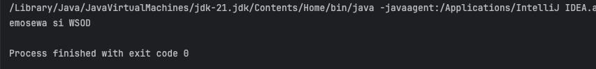
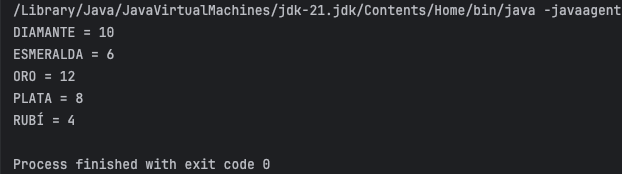
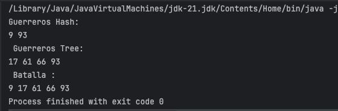
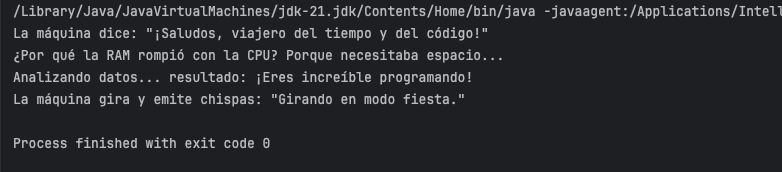

# Maratón Git 2025-2

**Integrantes**
- Julian Castiblanco Real
- Juan Carlos Leal Cruz

**Problemas Encontrados**

Julian tuvo un problema con IntelliJ debido a que la carpeta del repositorio constantemente desaparecía y luego al volver a clonar el respositorio no era posible ver la rama que creamos como equipo.

**feature/CatiblancoJualian_LealJuan_2025-2**

---

## Retos Completados

### Reto 1:
***Evidencia***

En la imagen se observa el reto 1 finalizado, para ello lo que hicimos fue crear dos clases super sencillas que son Estudiante y Mensaje. En estudiante pusimos todos los datos que se necesitan para el problema junto con sus respectivos getters y setters al igual que un toString() para entregar el texto en un formato en específico. En la clase de Mensaje creamos un método main para poder ejecutar y una lista donde almancenar a los estudiantes de tal manera que luego usando stream imprimimos el mensaje.

### Reto 2:
***Evidencia***

En las imágenes podemos ver el resultado de la ejecución de git log --oneline, de tal forma que vemos cada commit realizado para llegar al cumplimiento del reto. Cada uno de nosotros trabajó en una subrama diferente y fuimos haciendo merge conforme avanzabamos en los pasos.

Al final, tuvimos que solucionar varios conflictos de merge quitando los caracteres que se generaban y limpiado la carpeta .idea que nos generaba conflicto a la hora de hacer el push.

### Reto 3:
***Evidencia***

En la primera imagen podemos observar el resultado de la primera parte del reto que era repetir tres veces un string dejando un espacio y haciendo uso de StringBuilder y stream, por lo cual para dar solución a ese problema trabajamos en una subrama aparte para el reto 3 e hicimos merge con nuestra rama original para dejar el código en el sitio correcto.
En la segunda foto observamos el resultado del otro programa que tocaba realizar, por lo cual podemos ver que se logró invertir el mensaje tal y como se pedía; para realizar el código de igual forma se trabajó en una subrama la cual después se unió a la rama principal.

Ahora bien, en la última foto, podemos ver el compendio de la unión de los dos códigos realizados en la rama principal, se nos presentaron conflictos de merge los cuales solucionamos de forma manual y al igual que en el reto anterior, borrando la carpeta .idea para poder realizar el commit y el push.

### Reto 4:
***Evidencia***

En la imagen podemos evidenciar el resultado de imprimir el HashMap y el HashTahble bajo las indicaciones dadas, manteniendo como prioridad los valores del HashTable en caso de duplicados. De igual forma, vemos como las claves de cada una de las estructuras ahora se escriben con mayúscula gracias a la función que creamos usando stream para pasar solo las claves de mayúscula a minúscula.

### Reto 5:
***Evidencia***

En la imagen vemos cual es el resultado final que e obtuvo al generar ambos "ejercitos" basados en ciertas como condiciones como que elimine los múltiplos de 3 del HashMap y los múltiplos de 5 del TreeMap, de igual forma luego vemos la unión de ambos "ejercitos" para la batalla organizados de forma ascendente. 

### Reto 6:
***Evidencia***

En la imagen podemos ver el resultado de la ejecución de los comandos de forma correcta haciendo uso de un swtich para alternar entre cada comando. De igual forma se utilizo la pista del profesro para poder utiizar el run() y crear una función que monstrara cada uno de los String necesarios según el caso.

---
## Respuesta Preguntas

***1. Cuál es la diferencia entre git merge y git rebase***

La diferencia existente entre ambos comandos radica en el hecho de que merge ejecuta una operación no destructiva que evita la modificación de las ramas actuales y mantiene el historial de los commit. El comando rebase lo que hace es re-escribir el proyecto creando nuevos commits para cada uno de los originales en la rama Main, por lo cual, en el proceso, se pierde el historial de commits.

***2. Si dos ramas modifican la misma línea de un archivo ¿Qué sucede al hacer merge?***

Si se presenta el caso donde tratamos de modificar una misma parte de un mismo archivo se presenta un conflicto de Merge, donde Git no sabe cuál de las dos versiones usar. Debido a lo anterior, el merge solo se podrá completar hasta el momento en que se resuelva de forma manual el problema.

***3. ¿Cómo puedes ver gráficamente el historial de merges y ramas en consola?***

Esto se hace mediante el comando: git log --oneline --graph --all –decorate

***4. Explica la diferencia entre un commit y un push***

La diferencia radica en el entorno sobre el cual trabaja cada uno, commit se encarga de guardar los cambios en nuestro repositorio local y por otro lado push es lo que permite llevar estos cambios a un repositorio remoto.

***5. ¿Para qué sirve git stash y git pop?***

Git stash es un comando que se utiliza para guardar aquellos cambios que realizamos sobre el proyecto pero que todavía no están listos para publicar, siendo útil más que todo en contextos donde debemos cambiar de rama de trabajo antes d continuar, pero no queremos perder el progreso.

Git stash pop es el comando que utilizamos para recuperar los cambios guardados  y poder aplicarlos a la rama actual de forma correcta.

***6. ¿Qué diferencia hay entre HashMap y HashTable?***

Las diferencias existentes son:
* Mientras que un HashTable es thread – safe permitiendo que solo un hilo acceda a la información para así prevenir inconsistencias en los datos, los HashMap no lo son.
* Un HashTable no permite llaves o valores nulos, mientras que un HashMap si.
* La complejidad de búsqueda de un HashMap es mucho menor mientras que para un HashTable, la complejidad aumenta.

***7. ¿Qué ventajas tiene Collectors.toMap() frente a un bucle tradicional para llenar un mapa?***

El utilizar el comando indicado lo que obtenemos es un código mucho más compacto y mejor visualmente que un típico bucle for, de igual forma, nos ayuda a manejar las colisiones en caso de que se encuentren repetidas claves dentro del mapa haciendo uso de una lógica simple. Este es un método que nos permite trabajar con streams, lo cual nos facilita mucho el proceso a la hora de trabajar con datos que se almacenan en colecciones de tal forma que convertimos esa estructura de datos en un mapa para así poderla manipular fácilmente.

***8. Si usas List con objetos y luego aplicas stream().map() ¿Qué tipo de operación estas haciendo?***

Estamos realizando una operación de transformación donde stream() me permite trabajar con cada elemento de la lista de forma secuencial y map() se centra en aplicar una función a cada elemento del stream.

***9. ¿Qué hace el método stream().filter() y que retorna?***

Retorna los elementos filtrados basado en una condición que se le indique de forma previa retornando un stream. Si por ejemplo yo tengo:

list.stream().filter(lis -> lis.getSalary  > 5000)

En este caso, comvertimos la lista a un stream y con filter, procesamos cada dato contenido dentro de la lista original y solo se retorna aquellos que cumplan la condición de tener un salario mayor a 5000.

***10. Describe el paso a paso de cómo crear una rama desde develop si es una funcionalidad nueva.***

Seguimos el siguiente paso a paso:

git checkout develop

git pull

git checkout -b feature/nueva_rama

***11. ¿Cuál es la diferencia entre crear una rama con git branch y con git checkout -b?***

La diferencia radica en que el comando brach solo nos permite crear la rama, mientras que checkout -b nos deja crear la rama y manipularla.

***12. ¿Por qué es recomendable crear ramas feature/ para nuevas funcionalidades en lugar de trabajar en main directamente?***

Esta práctica se realiza debido a lo siguiente: 
* Evita que dañemos el código conforme lo vamos modificando. 
* Se puede trabajar en conjunto con el equipo de trabajo.
* Facilita las revisiones de los pull y logs
* Mejoramos la gestión de desarrollo al seguir la estructura de Git Flow 
