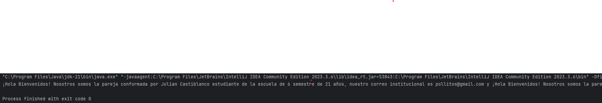
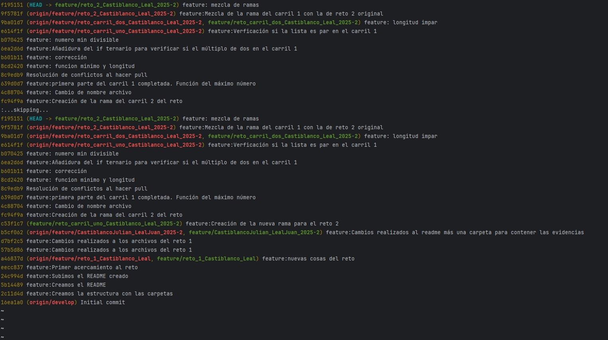
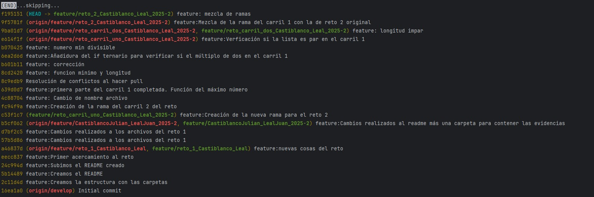
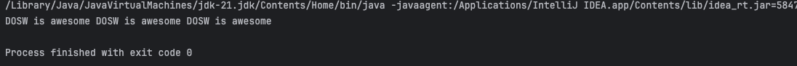
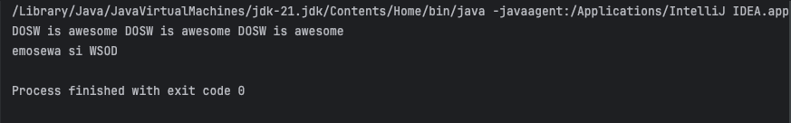

# Maratón Git 2025-2

**Integrantes**
- Julian Castiblanco Real
- Juan Carlos Leal Cruz

**Problemas Encontrados**

Julian tuvo un problema con IntelliJ debido a que la carpeta del repositorio constantemente desaparecía y luego al volver a clonar el respositorio no era posible ver la rama que creamos como equipo.

**feature/CatiblancoJualian_LealJuan_2025-2**

---

## Retos Completados

### Reto 1:
***Evidencia***

En la imagen se observa el reto 1 finalizado, para ello lo que hicimos fue crear dos clases super sencillas que son Estudiante y Mensaje. En estudiante pusimos todos los datos que se necesitan para el problema junto con sus respectivos getters y setters al igual que un toString() para entregar el texto en un formato en específico. En la clase de Mensaje creamos un método main para poder ejecutar y una lista donde almancenar a los estudiantes de tal manera que luego usando stream imprimimos el mensaje.

### Reto 2:
***Evidencia***

En las imágenes podemos ver el resultado de la ejecución de git log --oneline, de tal forma que vemos cada commit realizado para llegar al cumplimiento del reto. Cada uno de nosotros trabajó en una subrama diferente y fuimos haciendo merge conforme avanzabamos en los pasos.

Al final, tuvimos que solucionar varios conflictos de merge quitando los caracteres que se generaban y limpiado la carpeta .idea que nos generaba conflicto a la hora de hacer el push.

### Reto 3:
***Evidencia***

En la primera imagen podemos observar el resultado de la primera parte del reto que era repetir tres veces un string dejando un espacio y haciendo uso de StringBuilder y stream, por lo cual para dar solución a ese problema trabajamos en una subrama aparte para el reto 3 e hicimos merge con nuestra rama original para dejar el código en el sitio correcto.
En la segunda foto observamos el resultado del otro programa que tocaba realizar, por lo cual podemos ver que se logró invertir el mensaje tal y como se pedía; para realizar el código de igual forma se trabajó en una subrama la cual después se unió a la rama principal.

Ahora bien, en la última foto, podemos ver el compendio de la unión de los dos códigos realizados en la rama principal, se nos presentaron conflictos de merge los cuales solucionamos de forma manual y al igual que en el reto anterior, borrando la carpeta .idea para poder realizar el commit y el push.

