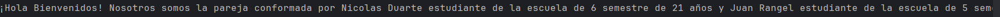
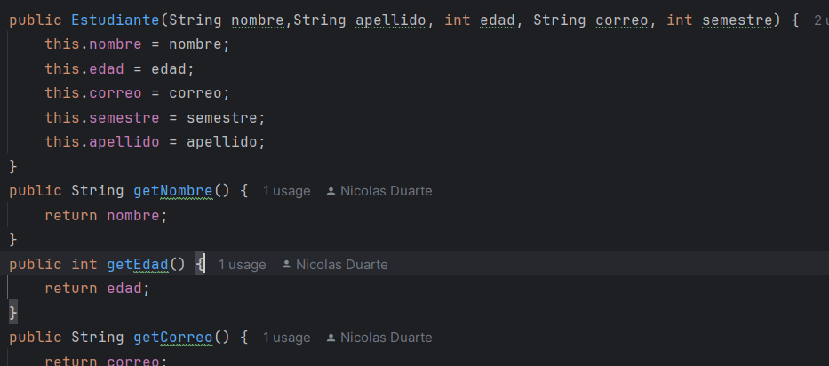
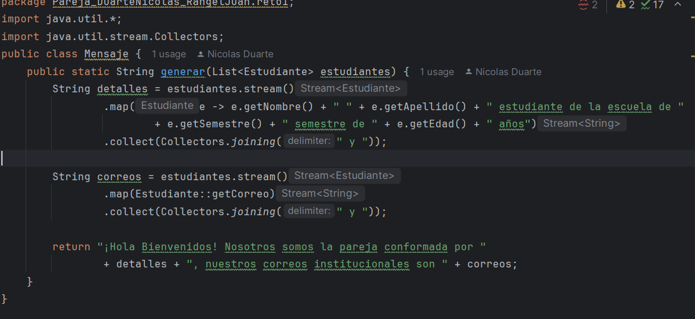

# Maraton git 2025-2

**integrantes:**
- Nicolas Duarte
- Juan Felipe Rangel

**Nombre de la rama:** feature/DuarteNicolas_RangelJuan_2025-2'
---

## Retos completados
Reto 1

creamos la clase estudiante donde definimos los parametros y sus getters.

Se creo la clase mensaje donde se implementaron las estructuras de stream() y collect junto a map(). donde
a partir de map se filtran los datos de cada estudiante para crear el mensaje luego con collect se juntan los
mensajes de ambos estudiantes.
