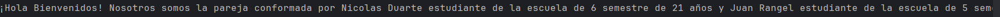
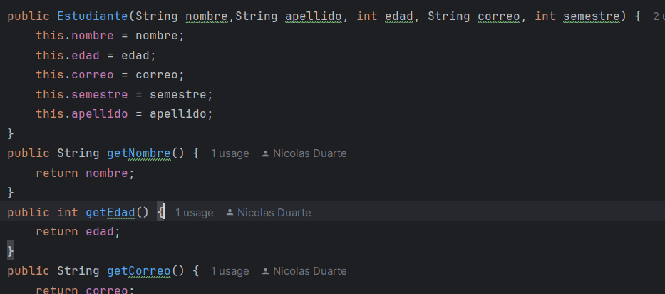
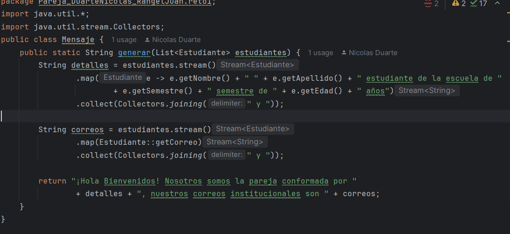
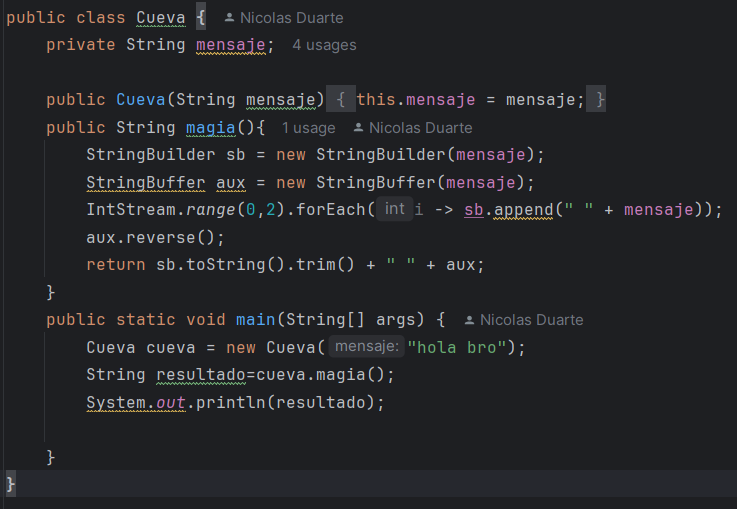
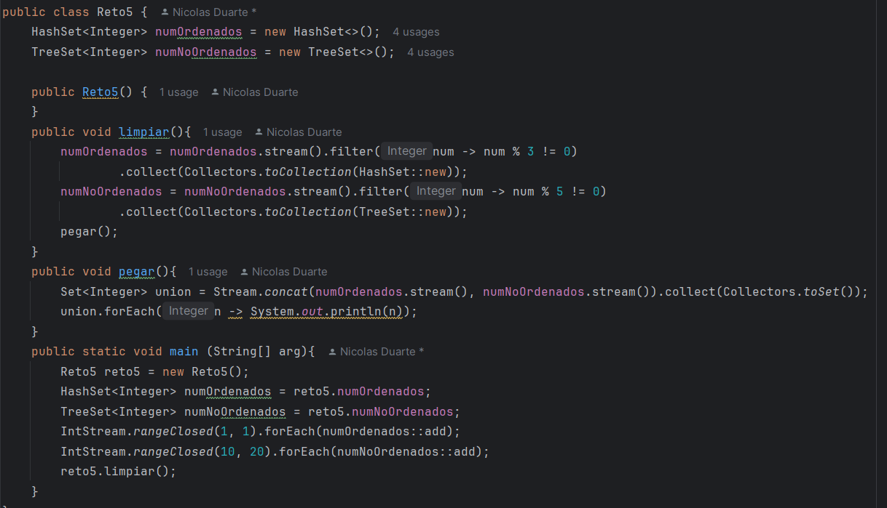

# Maraton git 2025-2

**integrantes:**

- Nicolas Duarte
- Juan Felipe Rangel

**Nombre de la rama:** feature/DuarteNicolas_RangelJuan_2025-2'
---

## Retos completados
**Reto 1**

creamos la clase estudiante donde definimos los parametros y sus getters.

Se creo la clase mensaje donde se implementaron las estructuras de stream() y collect junto a map(). donde
a partir de map se filtran los datos de cada estudiante para crear el mensaje luego con collect se juntan los
mensajes de ambos estudiantes.

**Reto 3**

Se crean tanto un string builder como un string buffer, donde usamos el builder como la opcion mas rapida y
el buffer como la opcion mas seguro, ya que esta tiene un manejo de hilos.
Luego usamos stream junto a funciones lambda, en este caso intStream.range lo cual hace que se repita la
accion en el rango, luego forEach() donde hacemos que se repita el mensaje junto al espacio deseado.
luego en el buffer usamos .reverse() el cual invierte el string dado.
Por ultimo retornamos el stream con toString() para volverlo string y .trim() para eliminar espacion fuera
de las palabras.
**Reto 5**

Creamos un HashSet para numeros no ordenas ya que este set tiene esa caracteristica, y un TreeSet para los
ordenados por esto mismo, luego mediante un .filter creamos las excepciones en ambos casos uno donde no 
puede haber multilpos de 3 y otro multiplos de 5, y estos resultados los guardamos con .collect().

luego hacemos la union de estos en un set<interger> con .concat()