# Maraton Git 2025-2

**Integrantes**
- Sebastian Albarracin Silva
- Julian Camilo Lopez

**Nombre de la rama:** feature/LopezJulian_AlbarracinSebastian_2025-2 

---

## Retos completados

### Reto 1: `RETO 1 COMPLETADO`
**Evidencia:** 
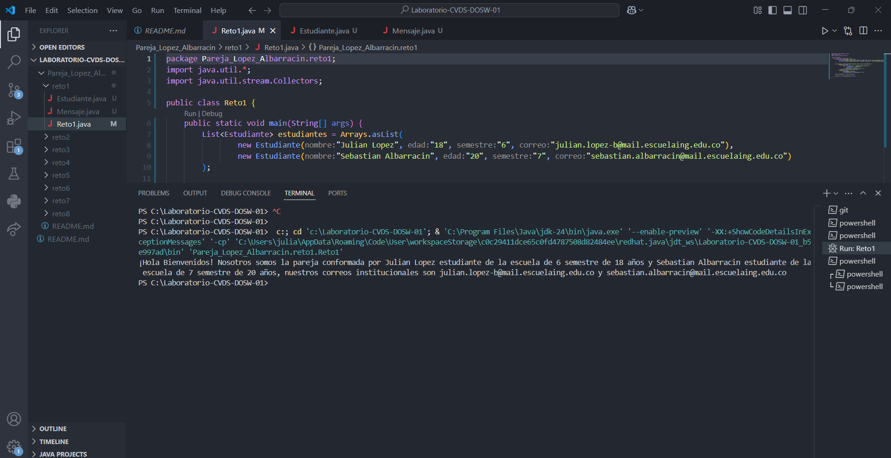

### Reto 2: `RETO 2 COMPLETADO`
**Evidencia:** 
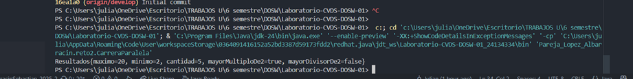
---
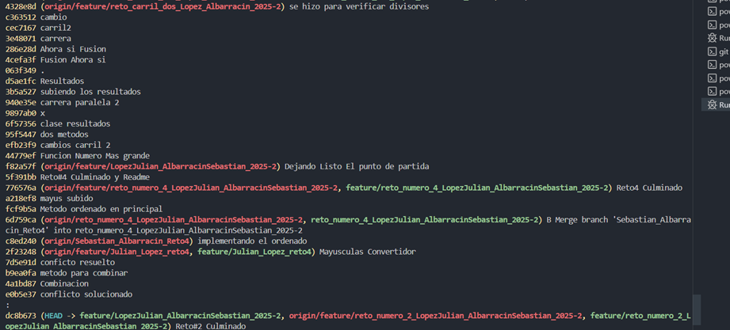
---
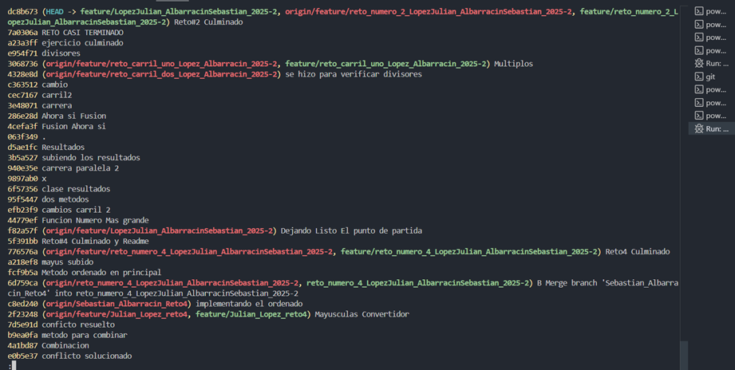
### Reto 3: `RETO 3 COMPLETADO `
**Evidencia Choque:** 
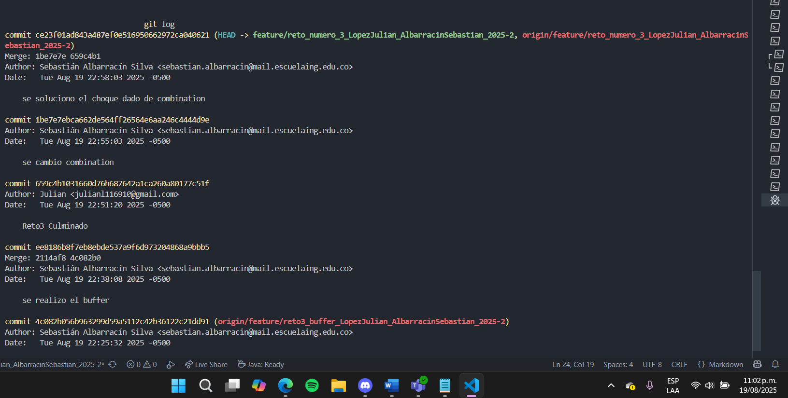
**Evidencia:** 
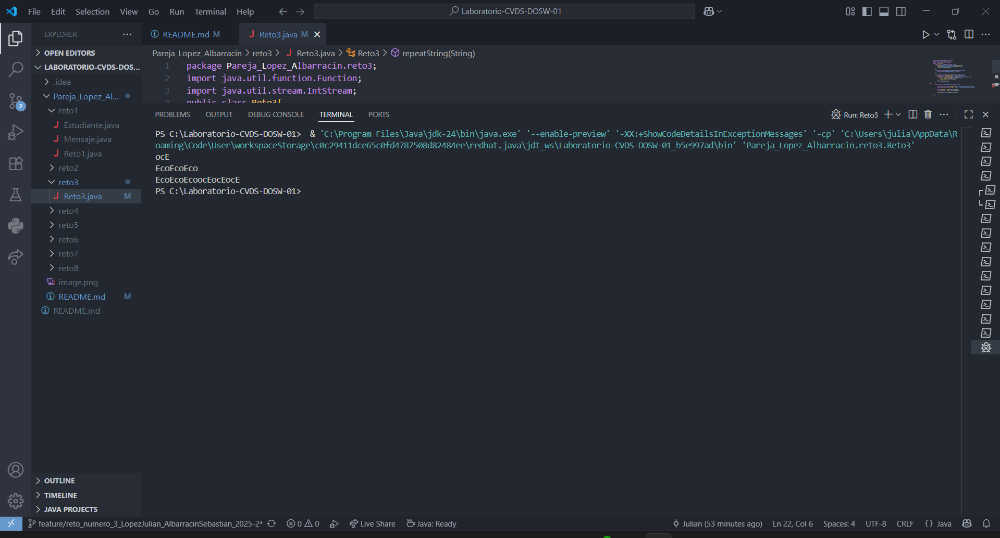

### Reto 4: `RETO 4 COMPLETADO`
**Evidencia:** 
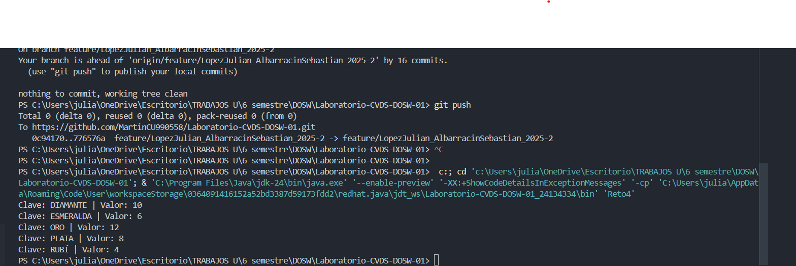
---
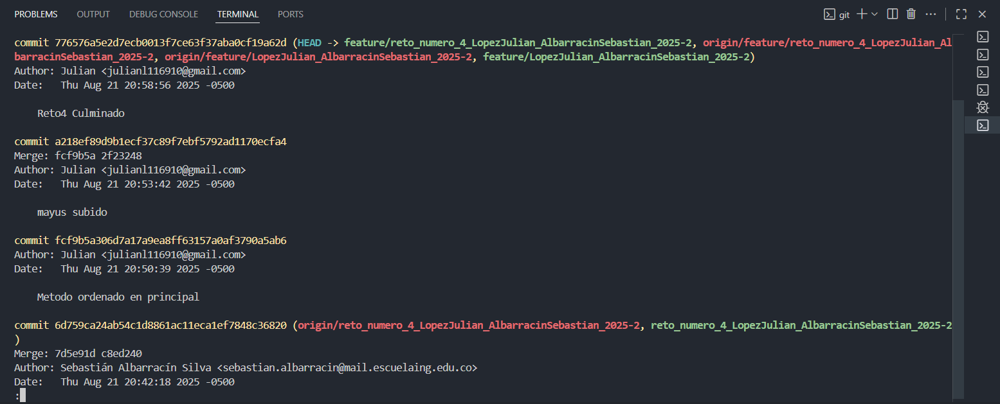

### Reto 5: `RETO 5 COMPLETADO `
**Evidencia Choque:**
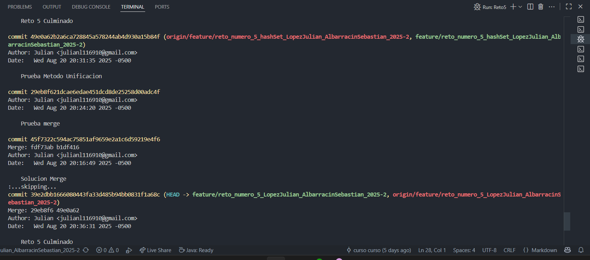
**Evidencia:** 
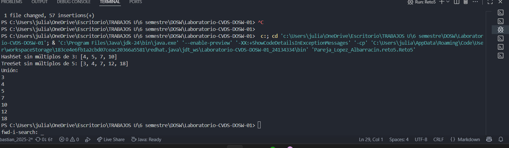

### Reto 6: `RETO 6 COMPLETADO `

**Evidencia:** 
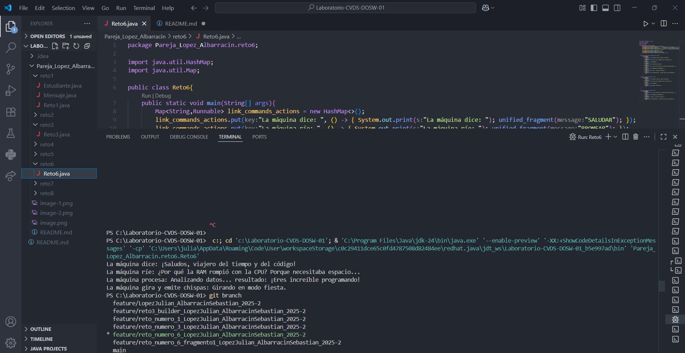

### Preguntas Teoricas

### 1. ¿Cuál es la diferencia entre git merge y git rebase?
- git merge conserva todo el historial de las distintas ramas, mostrando de forma explícita cuándo se fusionaron.  
- git rebase sobrescribe el historial para hacerlo más lineal y limpio, eliminando los commits de merge y "reaplicando" los cambios sobre la base deseada.

---

### 2. Si dos ramas modifican la misma línea de un archivo, ¿qué sucede al hacer merge?
- Lo que sucede al hacer merge es que se produce un conflicto de fusion el cual hay que solucionar "eligiendo lo que se quiere mantener"

---

### 3. ¿Cómo puedes ver gráficamente el historial de merges y ramas en consola?
- Para ver historial de merges:  

  `git log --merges`

- Para ver las ramas:  
  
  `git branch`
  

---

### 4. Explica la diferencia entre un commit y un push.
- **Commit:** Guarda los cambios en el historial.
- **Push:** Sube los commits locales al repositorio remoto.

---

### 5. ¿Para qué sirve git stash y git stash pop?
- **git stash:** sirve para guardar temoralmente cambios en el directorio actual 
- **git stash pop:** sirve para una vez guardados los cambios y si queremos incluirlos aplica los cambios almacenados y los elimina de la lista de cambios almacenados

---
### 6. ¿Qué diferencia hay entre HashMap y HashTable?
- **HashMap:** Permite claves y valores nulos.
- **HashTable:** No permite claves ni valores nulos.

---

### 7. ¿Qué ventajas tiene Collectors.toMap() frente a un bucle tradicional para llenar un mapa?
- La ventaja que tiene en cuanto a los ciclos es mas versátil puesto que los flujos de datos pueden venir de cualquier fuente de datos y este los transforma fácilmente a lo que se quiera

---

### 8. Si usas List con objetos y luego aplicas stream().map(), ¿qué tipo de operación estás haciendo?
- Se esta realizando una transformación que genera en la lista "nuevos" elementos

---

### 9. ¿Qué hace el método stream().filter() y qué retorna?
- Filtra los elementos según una condición , retorna un nuevo stream dejando pasar los elementos que cumplen la condición que se dio 

---

### 10. Paso a paso para crear una rama desde develop para una nueva funcionalidad

1. Verifica que estamos en la rama develop
   `git branch`
2. Crea y cambia a una nueva rama para la funcionalidad 
   `git checkout -b feature/nueva-funcionalidad`
3. Comienza a desarrollar las funcionalidades

---

### 11. ¿Cuál es la diferencia entre crear una rama con git branch y con git checkout -b?
- **git branch:** Crea la rama pero sin cambiarnos de una vez a esta.
- **git checkout -b :** Crea la rama y automaticamente nos lleva a la rama creada.

---

### 12. ¿Por qué es recomendable crear ramas `feature/` para nuevas funcionalidades en lugar de trabajar en `main` directamente?
- Feature se usa para no generar conflictos de trabajo con nuestro equipo debido a que en estas lo que hacemos es desarrollar nuevas características de lo que queramos sin interferir en develop que es la rama principal en la que se integra todo lo desarrollado en feature.

---

