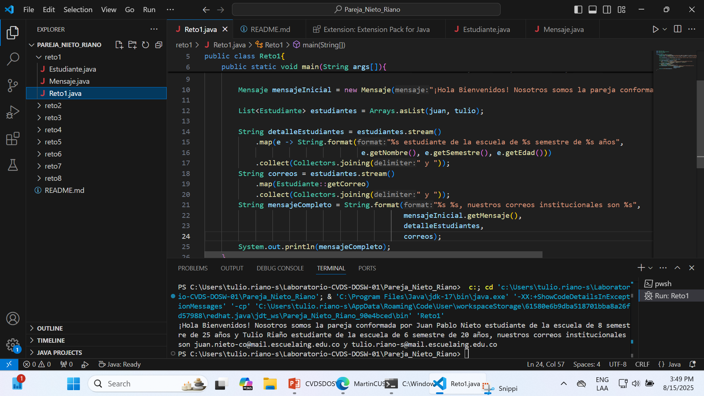
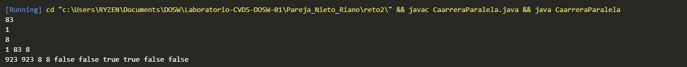

# Maraton Git 2025-2

**Integrantes:**

- Juan Pablo Nieto Cortes
- Tulio Riaño Sánchez

**Nombre de la rama:** feature/NietoJuan_TulioRiano_2025-2

---

### Reto 1: Primer reto culminado

**Evidencia**

Se desarrollo de manera correcta el reto con los objetos estudiante y mensaje

### Reto 2: Segundo reto culminado

**Evidencia**

Mediante esta carrera paralela se crearon los diferentes objetos que iban a contener funcionalidades asociadas al reto, de la misma manera se resolvieron todo tipo de conflictos.

### Reto 3: Tercer reto culminado

**Evidencia**

Mediante este reto se aprendio la existencion de Function, como manipular los streams en string builder y lambda para invocar funciones.

### Reto 4: Cuarto reto culminado

**Evidencia**

Mediante streams y lambda desarrollamos los ejercicios que involucraban el uso de HashMap y Hashtable.

### Reto 5: Quinto reto culminado

**Evidencia**

Utilizando el objeto random se insertaron valores aleatorios y a cada uno se le creo una funcion que dependiendo el caso eliminaba los multiplos de 3 como los multiplos de 5, luego se unificaron eliminandos valores duplicados antes de imprimir

### Reto 6: Sexto reto culminado

**Evidencia**

Inicialmente el primer estudiante tiene que mediante un switch case hacer una conversacion mediante el string correspondiente, en la funcion principal utilizando Map<String,Runnable> y el metodo de run, lambdas se invocan las funciones donde se evidencia los primeros resultados.

Por otra parte el segundo estudiante debe de utilizar nuevamente el switch case pero mediante otros comandos como bromear, gritar, susurrar y analizar.

Por ultimo ocurre un choque en el codigo donde se unifican los comandos en un solo switch y se usa lambda para ejecutar la accion, tras esto se resolvieron los conflictos en el merge.

### Parte 3 - Cuestionario:
