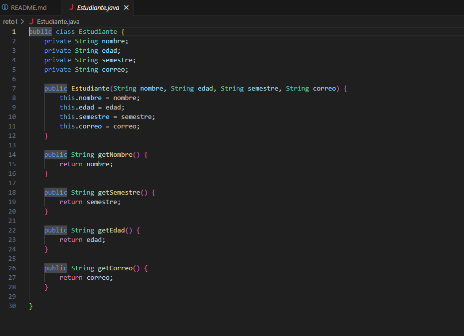
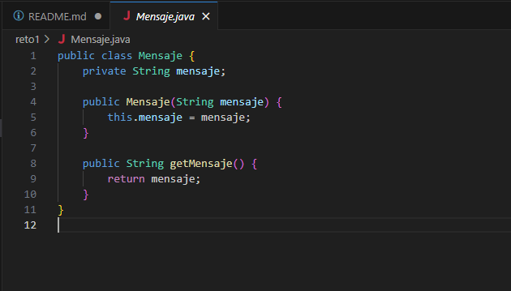
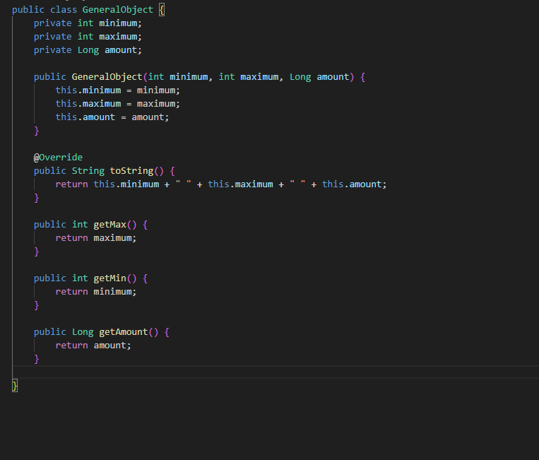
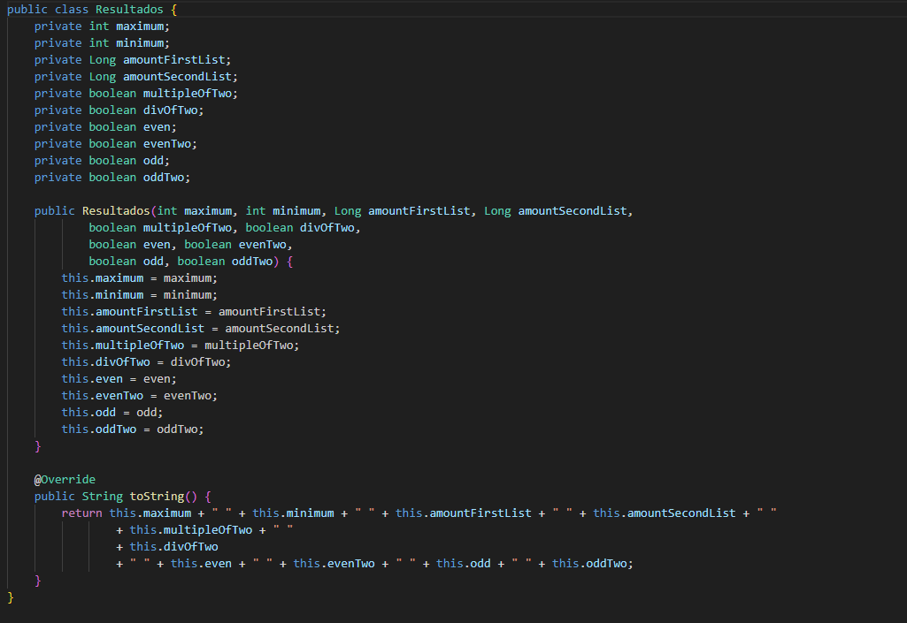
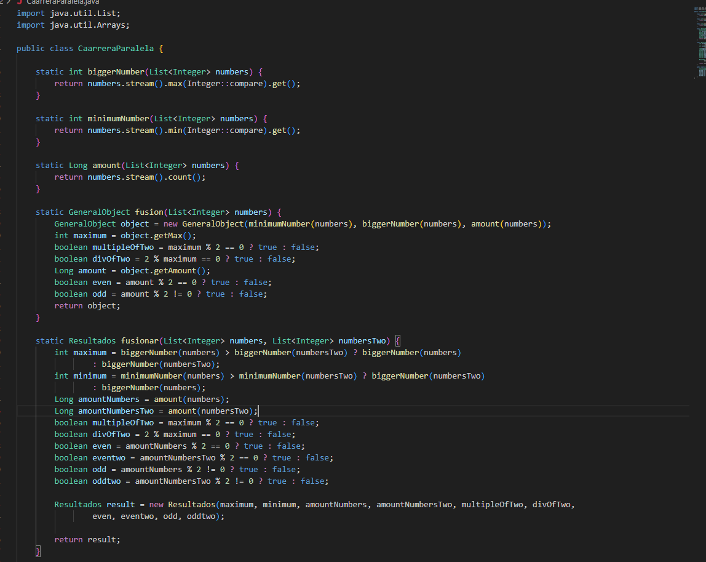
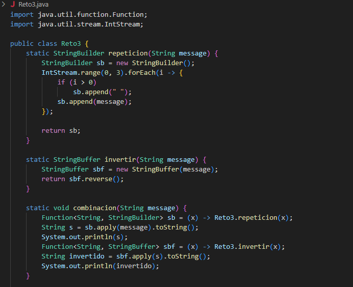
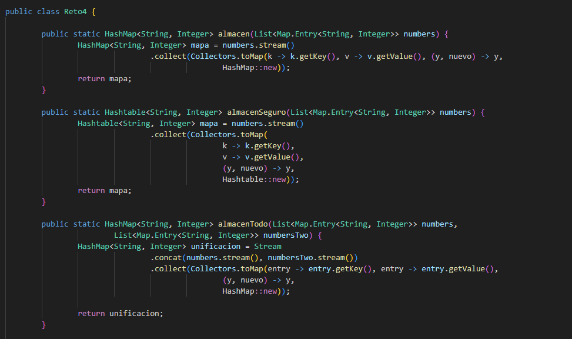
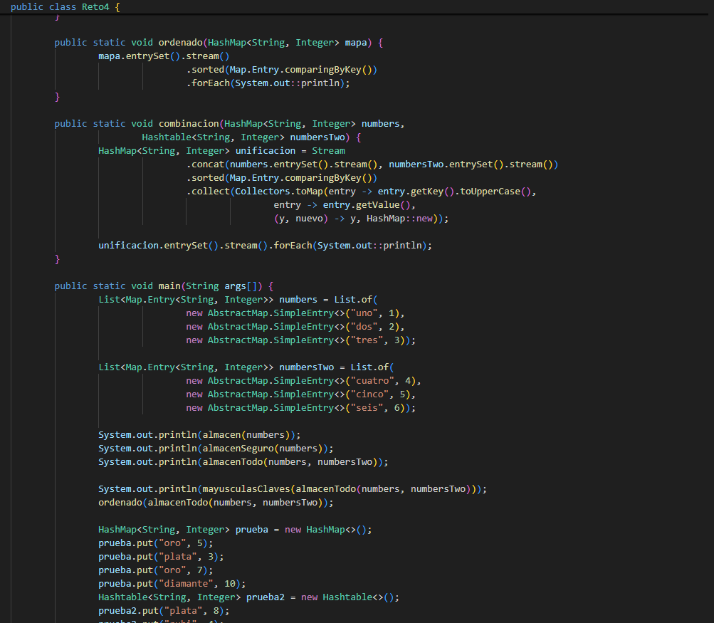
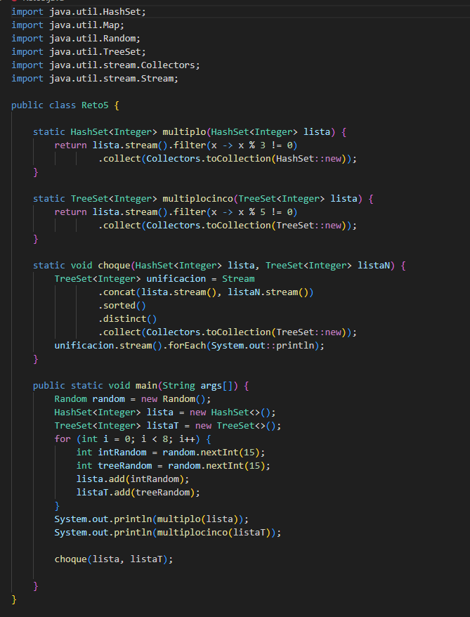

# Maraton Git 2025-2

**Integrantes:**

- Juan Pablo Nieto Cortes
- Tulio Riaño Sánchez

**Nombre de la rama:** feature/NietoJuan_TulioRiano_2025-2

---

### Reto 1: Primer reto culminado

**Evidencia**

### Clase Estudiante:
**Evidencia**

### Clase Mensaje:
**Evidencia**

### Descripción:
Para la solución de este reto, creamos dos nuevos objetos Estudiante y Mensaje Bienvenida tras esto pasamos a la función principal Reto1 donde en la función principal creamos estos objetos y los almacenamos en una List para imprimir mediante streams un mensaje de bienvenida acorde, para esto utilizamos concat que une dos streams a uno solo.

---

### Reto 2: Segundo reto culminado

**Evidencia**
**Creación Objeto General**

**Historial completo mediante git log--oneline**

**Creacion Objeto Resultados**

**Resultados finales tras fusión**

Mediante esta carrera paralela se crearon los diferentes objetos que iban a contener funcionalidades asociadas al reto, de la misma manera se resolvieron todo tipo de conflictos.

---

### Reto 3: Tercer reto culminado

**Evidencia**

Mediante este reto se aprendio la existencion de Function, como manipular los streams en string builder y lambda para invocar funciones.

---

### Reto 4: Cuarto reto culminado

**Evidencia**

**Resultados con el input propuesto**

Para la solución de este punto utilizamos streams, map, sorted y distinct para poder manejar valores repetidos y ordenarlos. Al final en el feature combinamos todas las funciones realizadas y resolvimos todo tipo de conflictos.

---

### Reto 5: Quinto reto culminado

**Evidencia**

Utilizando el objeto random se insertaron valores aleatorios y a cada uno se le creo una funcion que dependiendo el caso eliminaba los multiplos de 3 como los multiplos de 5, luego se unificaron eliminandos valores duplicados antes de imprimir, nuevamente se resolvieron los conflictos de manera correcta.

---

### Reto 6: Sexto reto culminado

**Evidencia**

Inicialmente el primer estudiante tiene que mediante un switch case hacer una conversacion mediante el string correspondiente, en la funcion principal utilizando Map<String,Runnable> y el metodo de run, lambdas se invocan las funciones donde se evidencia los primeros resultados.

Por otra parte el segundo estudiante debe de utilizar nuevamente el switch case pero mediante otros comandos como bromear, gritar, susurrar y analizar.

Por ultimo ocurre un choque en el codigo donde se unifican los comandos en un solo switch y se usa lambda para ejecutar la accion, tras esto se resolvieron los conflictos en el merge.

### Parte 3 - Cuestionario:

1. Cuál es la diferencia entre git merge y git rebase
2. Si dos ramas modifican la misma línea de un archivo ¿Qué sucede al hacer merge?
3. ¿Cómo puedes ver gráficamente el historial de merges y ramas en consola?
4. Explica la diferencia entre un commit y un push?
5. Para que sirve git stash y git pop?
6. Qué diferencia hay entre HashMap y HashTable?

---

### 7. Qué ventajas tiene Collectors.toMap() frente a un bucle tradicional para llenar un mapa?
- Permite construir mapas de forma **más declarativa y concisa** usando programación funcional.
- Mejora la **legibilidad** del código al evitar bucles explícitos.
- Se integra con el API de **Streams**, facilitando transformaciones y filtros antes de la inserción.
- Reduce la posibilidad de errores manuales en la manipulación del mapa.
- Facilita la paralelización de operaciones al trabajar con streams.

---

### 8. Si usas List con objetos y luego aplicas stream().map() que tipo de operación estas haciendo?
- Se está realizando una **operación de transformación**.
- Cada elemento del stream se convierte en otro valor según la función definida en `map()`.
- El resultado es un **nuevo stream** con los valores transformados.

---

### 9. Qué hace el método stream().filter() y qué retorna?
- `filter()` aplica una **condición lógica (predicado)** sobre los elementos del stream.
- Mantiene únicamente los elementos que cumplen esa condición.
- Retorna un **Stream filtrado**, que contiene solo los elementos válidos según el predicado.

---

### 10. Describe el paso a paso de cómo crear una rama desde develop si es una funcionalidad nueva.
1. Estar en la rama `develop`:
   
   git checkout develop

2. Actualizar la rama develop con los últimos cambios del remoto:

git pull origin develop

3. Crear y cambiarse a la nueva rama de funcionalidad:

git checkout -b feature/nombre_funcionalidad

4. Confirmar que estás en la nueva rama:

git branch

5. Subir la rama al remoto:

git push -u origin feature/nombre_funcionalidad

---

11. **¿Cuál es la diferencia entre crear una rama con `git branch` y con `git checkout -b`?**  

- `git branch nombre_rama`: únicamente crea la rama, pero no cambia a ella. El usuario sigue estando en la rama actual.  
- `git checkout -b nombre_rama`: crea la nueva rama y además cambia automáticamente a trabajar en ella.  

---

12. **¿Por qué es recomendable crear ramas feature/ para nuevas funcionalidades en lugar de trabajar en main directamente?**  

Es recomendable porque:  
- Permite aislar el desarrollo de nuevas funcionalidades sin afectar la rama principal.  
- Evita que errores o código en construcción se mezclen con la versión estable en `main`.  
- Facilita el trabajo colaborativo, ya que cada desarrollador puede trabajar en su propia rama.  
- Mejora el control de versiones y la trazabilidad de cambios.  
- Permite integrar la funcionalidad mediante *pull requests* o *merge requests*, aplicando revisiones de código antes de llegar a `main`.  

