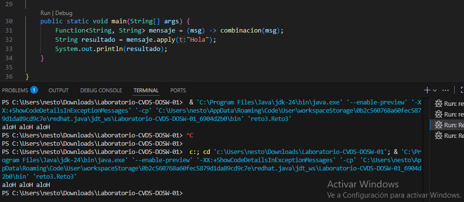

# Laboratorio-CVDS-DOSW-01
**Integrantes**
-Juan Sebastian Puentes Julio
-Nestor David Lopez Castañeda
**   ** feature/Puentes_Lopez_2025-2

---
## Retos Completados 

### Reto 1: La Bienvenida
### Para este primer reto, se nos solicitó crear dos objetos: Estudiante y MensajeBienvenida. Además, se debía utilizar la estructura List y aplicar los métodos de programación funcional: stream(), map() y collect().
### Como primer paso, implementamos la clase Estudiante:
### En esta clase definimos los atributos necesarios, implementamos el constructor y generamos los métodos getters correspondientes para acceder a la información de cada estudiante.

### Como se puede observar en la imagen lo primero que hicimos fue definir los atributos de estudiante, realizando el respectivo constructor y los getters.
### A continuación, desarrollamos la clase MensajeBienvenida:

### En esta clase, construimos un método que, utilizando stream(), map() y collect(), genera un mensaje de bienvenida personalizado a partir de la lista de estudiantes. El resultado es un mensaje concatenado con los nombres de todos los participantes.

### Una vez completadas ambas clases, nos dirigimos al método main, donde almacenamos los datos de los estudiantes (en este caso, los integrantes de nuestro dúo) en una lista. Luego, llamamos a la función generadora del mensaje de bienvenida e imprimimos el mensaje solicitado.

### Reto 2: Carrera en Paralelo
### El primer paso consiste en cambiar el nombre del archivo, crear las subramas correspondientes y definir los métodos necesarios. Una vez realizados estos pasos, ejecutamos git merge y nos enfrentamos al primer conflicto.

### Resolución del primer conflicto
### Procedemos a resolver los conflictos generados y realizamos la combinación de ramas. Posteriormente, continuamos con las instrucciones y nos preparamos para enfrentar el segundo y tercer conflicto.

### Implementación final y solución
### Finalmente, creamos la función requerida, realizamos la combinación de ramas restante, resolvemos los conflictos pendientes y obtenemos la solución completa del problema.

### Reto 3: El eco misterioso
**Para este reto, comenzamos creando las ramas correspondientes: una para la implementación con StringBuilder y otra para StringBuffer.**

## Una vez creadas las ramas, procedimos a realizar un git merge para combinarlas. Durante este proceso, resolvimos los conflictos que surgieron entre ambas implementaciones.

### En la solución final del reto, contamos con los métodos y el main necesarios para resolver el problema planteado. Es importante destacar que la función que unifica el uso de ambos métodos (StringBuilder y StringBuffer) fue desarrollada por ambos integrantes del equipo, y luego se integró mediante una fusión de ramas (merge).

### Y este seria el resultado esperado.

### Reto 4: El tesoro de las Llaves duplicadas 
**Para este reto, comenzamos creando las ramas correspondientes, en las cuales desarrollamos los métodos solicitados. Posteriormente, realizamos la combinación de las ramas (merge) y comparamos los cambios, resolviendo los conflictos que surgieron durante el proceso.**

### Luego implementamos las funciones requeridas, volvimos a hacer un merge y verificamos que el resultado fuera el esperado.

### Reto 5: Batalla de Conjuntos
### En este reto, comenzamos creando las ramas correspondientes: una para la implementación con HashSet y otra para TreeSet, en las cuales desarrollamos los métodos requeridos.

### Una vez que ambos cambios fueron subidos, realizamos un merge y solucionamos los conflictos que surgieron. Posteriormente, procedimos a crear la función que unifica ambos conjuntos (Sets).

### Finalmente, al ejecutar el programa, obtenemos la impresión del resultado esperado.

### Reto #6: La máquina de decisiones
**Para el reto 6 lo primero que vamos a hacer es crear las respectivas ramas creando el fragmento 1 y 2 y haciendo lo que este nos pide respetivamente**

## Para este reto, comenzamos creando las ramas correspondientes, denominadas Fragmento 1 y Fragmento 2, y desarrollamos en cada una las funcionalidades que se nos solicitaron.

### Luego, combinamos ambas ramas mediante un merge en la rama principal del reto 6, donde resolvimos los conflictos y dejamos el código completamente funcional.
### Después, implementamos el método que integra y unifica ambos fragmentos para que funcionen de manera conjunta.

### Finalmente, realizamos un merge de la rama principal del reto 6 con la rama principal del proyecto, donde se encuentran las demás soluciones de los retos anteriores.
## Preguntas teóricas
## ⦁	Cuál es la diferencia entre git merge y git rebase
## La diferencia principal que podemos encontrar es que el git rebase nos va a dejar un historial mas limpio y cuenta con capacidades de iteracion rapida. Por otro lado el merge sirve mas para evidenciar y es ma spara cuando se necesita colaboración, transparencia y los registros de auditoría 
## ⦁	Si dos ramas modifican la misma línea de un archivo ¿Qué sucede al hacer merge?
## El principal problema que se va a presentar cuando suceda esto es que git no puede determinar cual de los dos cambios aceptar por lo que va a generar un conflicto, el cual debe resolverse para luego ahi si hacer el merge.
## ⦁	¿Cómo puedes ver gráficamente el historial de merges y ramas en consola?
## Para poder ver el historial de merge en la consola vamos a usar el comando git log y para ver el historial de ramas en consola usamos git log o en algunos casos git branch
## ⦁	Explica la diferencia entre un commit y un push?
##  La diferencia principal que podemos ver entre commit y push es que commit trabaja en el repositorio local mientras que mientras que el push lo hace con el repositorio remoto.
## ⦁	Para que sirve git stash y git pop?
## El git stash almacena los cambios temporalmente los cambios no confirmados en el directorio de trabajo y el pop lo que va a hacer es aplicar los cambios guardados en el stash y lo elimina automaticamente
## ⦁	Qué diferencia hay entre HashMap y HashTable?
## La principal diferencia que podemos encontrar es que el HashTable es mejor para aplicaciones multihilo ya que esta es mejor por que ofrece sincronización en los métodos de acceso y mutación, que impedirán que dos hilos diferentes agreguen o eliminen de manera concurrente de la lista. Otra diferencia importante es que Hashtable no permite llaves o valores null, mientras que HashMap permite una llave y cualquier vantidad de valores null.

## Referencias:
## -https://www.datacamp.com/es/blog/git-merge-vs-git-rebase
## -http://codigoelectronica.com/blog/fusion-de-ramas-con-git-merge
## -https://es.stackoverflow.com/questions/1234/cu%C3%A1l-es-la-diferencia-entre-hashmap-y-hashtable-en-java
---
