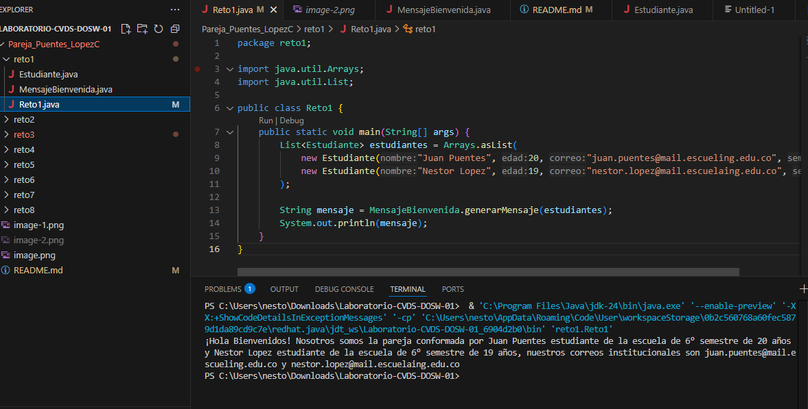

# Laboratorio-CVDS-DOSW-01
**Integrantes**
-Juan Sebastian Puentes Julio
-Nestor David Lopez Castañeda
**   ** feature/Puentes_Lopez_2025-2

---
## Retos Completados 

### Reto 1: La Bienvenida
### Para este primer reto nos pedian crear dos objetos, el objeto estudiante y el objeto mensaje de bienvenida. Ademas nos decian que debiamos usar la estructura list y adicionalmente los comandos stream(), map() y collect().
### Para esto primero decidimos crear la clase estudiante

### Como se puede observar en la imagen lo primero que hicimos fue definir los atributos de estudiante, realizando el respectivo constructor y los getters.
### A continuacion creamos  La clase MensajeBienvenida:

### Para esta clase hicimos el constructor y usando collectors y el stream creamos el mensaje retornando ya el mensaje final.

### Una vez hecho esto ya podremos dirigirnos al main en donde guardamos en una lista los datos de los estudiantes que van a dar la bienvenida, en este caso nosotros los integrantes de este duo y llamamos a la funcion mensaje de bienvenida imprimiendo el mensaje solicitado.

### Reto 2: Carrera en Paralelo
**Evidencia**

### Reto 3: El eco misterioso
**Para el reto 3 en un primer momento vamos a empezar creando las respectivas ramas la de builder y la de buffer**

## Una vez creadas lo que vamos a hacer es combinarlas mediante el merge y resolver lo posibles errores que estas nos presenten.

### Asi en reto 3 vamos a tener los metodos y el main que nos resuelva este problema. Cabe destacar que la funcion que creamos para fucionar los dos metodos la hicimos los dos y luego hicimos un merge.

### Y este seria el resultado esperado.

### Reto 4: El tesoro de las Llaves duplicadas 
**Evidencia**

### Reto 5: Batalla de Conjuntos
**Evidencia**

### Reto #6: La máquina de decisiones
**Evidencia**

## Preguntas teóricas
**Evidencia**
---
