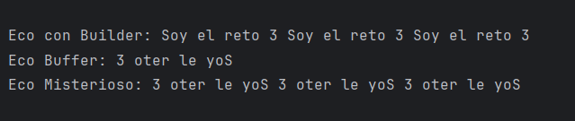
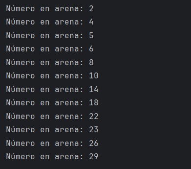

# Maratón Git 2025 - 2

- Deisy Lorena Guzmán Cabrales
- Julián Santiago Ramírez Urueña

feature/RamirezJulian_GuzmanDeisy_2025-2

## Retos Completados

- Se decidió dividir el trabajo de los retos por a parte, dado
que era complejo realizar las contribuciones en simultáneo como
lo pidió el profesor. 

### Reto 1: 
Para la solución del reto #1, se trabajó a partir de una lista
de estudiantes constituida por el objeto estudiante, donde cada
uno cuenta con su nombre, edad, correo y semestre.
Del mismo modo se generó una lista de mensajes para así poder 
darlos a conocer a través del texto de presentación como lo sugería 
el enunciado.

### Reto 2:
Para satisfacer la solicitud del enunciado del reto 2, se creó la clase
'NumberClassifier'. Aquella que cumple la función de (precisamente) clasificar
los números pertenecientes a las listas a analizar. Dicha clase contiene los métodos
(soportados por la API Stream de Java) que permitirán encontrar el valor máximo y mínimo 
de los arreglos en conjunto a su condición de paridad, tal y como lo solicitó el inciso
número dos.

### Reto 3:

En este reto se crearon dos métodos principales para cumplir con los requisitos:

Método con StringBuilder

Se creó un método que recibe un mensaje y lo repite 3 veces concatenado con espacios.
Para lograrlo, se implementó un StringBuilder en conjunto con stream(), generando las repeticiones mediante IntStream.range y uniendo el resultado con Collectors.joining(" ").

Método con StringBuffer

Se creó un método que recibe un mensaje y lo invierte.
Se implementó StringBuffer aprovechando el método reverse(), lo que permitió cumplir con la parte de seguridad en hilos.

Método combinado

Ambos métodos usaron el mismo nombre, lo que generó un conflicto en el merge.
Se resolvió el conflicto creando una versión final que primero repite el mensaje 3 veces con StringBuilder y luego aplica la inversión con StringBuffer.
Uso de lambda y streams
Se implementó una función lambda para invocar los métodos de forma compacta.
Se utilizó stream() para manejar las repeticiones, garantizando una solución declarativa y eficiente.

### Reto 4:
Se crearon las dos estructuras de los dos mapas del tesoro distintos (HashMap y HashTable). 
Se insertaron los elementos de cada mapa (aportados por la entrada expuesta en el inciso) para
después realizar la fusión entre estos y sobreescribiendo los valores según el caso.

### Reto 5:
En este reto se crearon dos métodos principales que representan a cada estudiante:

HashSet (Estudiante A)
Se creó un método que genera 10 números aleatorios sin orden.
Se implementó un filtro con stream().filter() para eliminar los múltiplos de 3.

TreeSet (Estudiante B)
Se creó un método que genera 10 números aleatorios en orden ascendente.
Se implementó un filtro con stream().filter() para eliminar los múltiplos de 5.

Unión de conjuntos

Se creó una colección final con TreeSet que unió los dos conjuntos en una sola estructura ordenada.
Esta unión eliminó automáticamente los duplicados.

Impresión con lambda

Se utilizó forEach con una función lambda para mostrar los resultados en pantalla, siguiendo el formato pedido.

### Reto 6:
Con la ayuda del switch case y las expresiones lambda, se consiguió definir cada uno de los casos
asociados al comportamiento de la máquina del reto numero seis. 

### NOTA EN RELACIÓN A LOS AJUSTES POSTERIORES A LA ENTREGA:

- Después de un llamado de atención dirigido por el profesor Andrés Cantor
se nos recomendó una implementación mucho más organizada, en pro de mantener un flujo
de trabajo en equipo mayormente limpio y superior.
Razón por la cual, se decidió dejar todo lo  trabajado en la rama principal correspondiente 
a nuestro grupo de trabajo.

## Cuestionario Conceptual

1. ¿Cuál es la diferencia entre git merge y git rebase?
Por un lado, 'git merge' fusiona los commits para combinar una rama 
con otra manteniendo el historial original de cada una. En cambio, 
'git rebase' cumple una función similar, pero, reescribe el historial 
de los commits en la rama destino; es decir, hace parecer que sólamente
se trabajó allí.

2. Si dos ramas modifican la misma línea de un archivo. ¿Qué pasará al hacer merge?
Se presentará un choque o conflicto de modo que, como se está trabajando 
de forma independiente en una misma área, Git "no sabrá" qué versión del 
archivo conservar. Es necesario resolver el conflicto mencionado de forma 
manual.

3. ¿Cómo puedes ver el historial de merges y ramas en consola?
Con el comando git log, especificando según lo necesario.

4. ¿Diferencia entre un commit y un push? 
Git commit se encarga del repositorio local mientras que git push, está al mando del 
repositorio remoto. Sin embargo, es importante destacar que se tiene que ejecutar git 
commit para poder luego, ejecutar git push.

5. ¿Para que sirve git stash y git pop?

   git stash sirve para guardar temporalmente los cambios realizados en el área de trabajo sin necesidad de hacer un commit, dejando el repositorio en un estado limpio. 
   
   git pop sirve para recuperar esos cambios guardados y aplicarlos nuevamente a la rama actual, eliminando el registro del stash aplicado.

6. ¿Diferencias entre HashMap y HashTable?
"HashTable es sincronizado y seguro para subprocesos multihilo, mientras que HashMap es 
más rápido para entornos de únicamente un proceso.

7. ¿Qué ventajas tiene Collectors.toMap() frente a un bucle tradicional para llenar un mapa?

   Permite escribir código más corto y legible.

   Es declarativo, describe lo que se quiere lograr en lugar de los pasos para hacerlo.

   Facilita el trabajo con streams en paralelo.

   Permite manejar directamente situaciones de claves duplicadas con funciones de resolución.

8. Si usas List con objetos y luego aplicas stream().map(), ¿qué tipo de operación estás haciendo?
   Se está haciendo una operación de transformación, ya que map() toma cada elemento de la lista y lo convierte en otro tipo de dato o representación, devolviendo un nuevo stream con los elementos transformados.
 

9. ¿Qué hace el método stream().filter() y qué retorna?
   El método filter() aplica una condición booleana a cada elemento y devuelve un nuevo stream con únicamente los elementos que cumplen dicha condición.

10. Describe el paso a paso de cómo crear una rama desde develop si es una funcionalidad nueva.

    Cambiar a la rama develop.

    Actualizar los cambios de develop desde el repositorio remoto.

    Crear una nueva rama con el nombre de la funcionalidad.

    Trabajar en la nueva rama y subir los cambios al repositorio remoto.

11. ¿Cuál es la diferencia entre crear una rama con git branch y con git checkout -b?

    Con git branch únicamente se crea la rama, pero no se cambia a ella.

    Con git checkout -b se crea la rama y además se cambia automáticamente a trabajar en ella.

12. ¿Por qué es recomendable crear ramas feature/ para nuevas funcionalidades en lugar de trabajar en main directamente?

    Porque permite mantener el main estable y funcional, organiza mejor el trabajo, evita errores en la rama principal, facilita el trabajo en equipo y la integración de cambios mediante revisiones antes de ser fusionados.