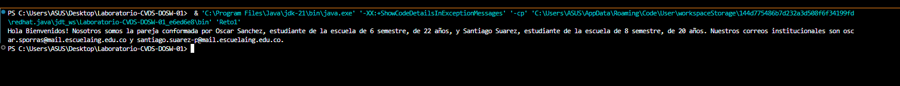
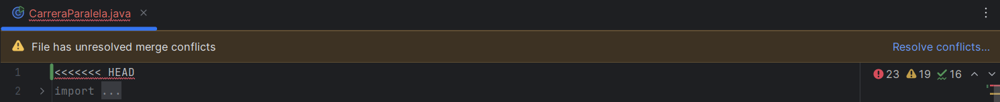
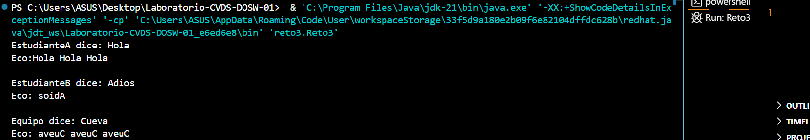
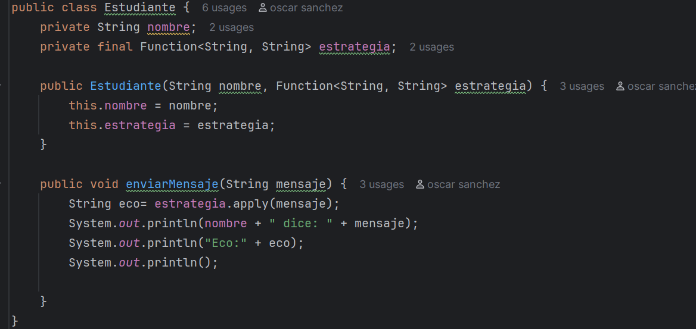
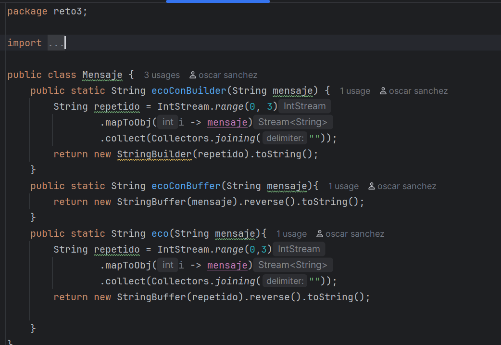
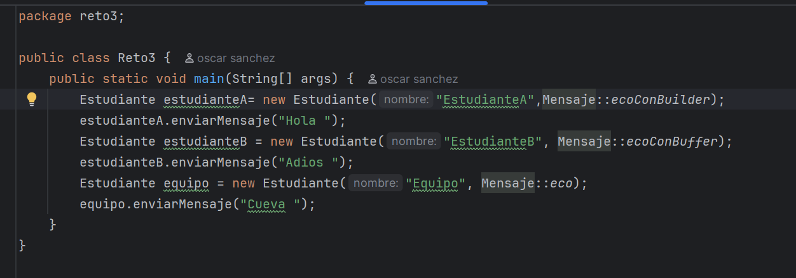
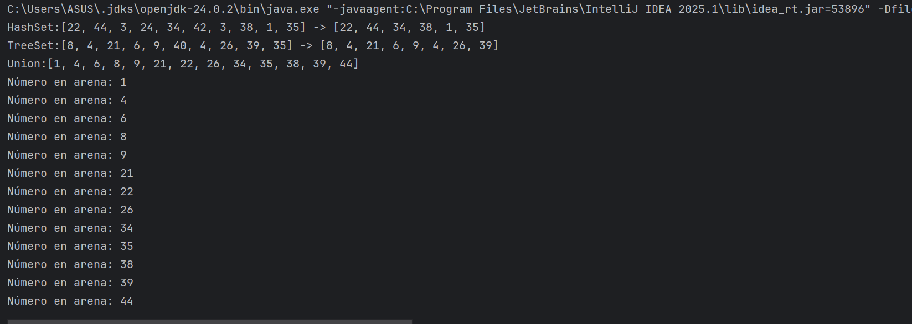
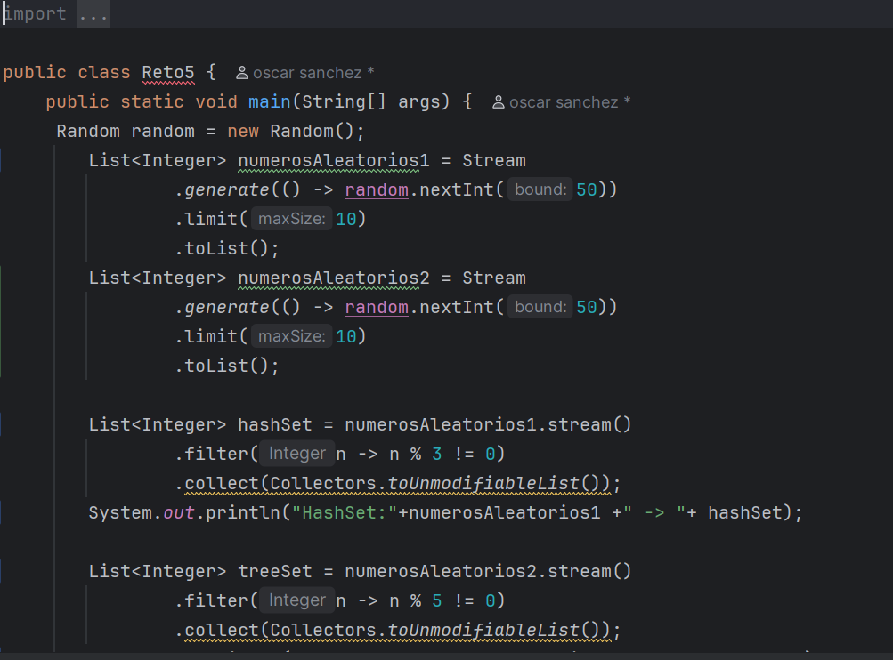
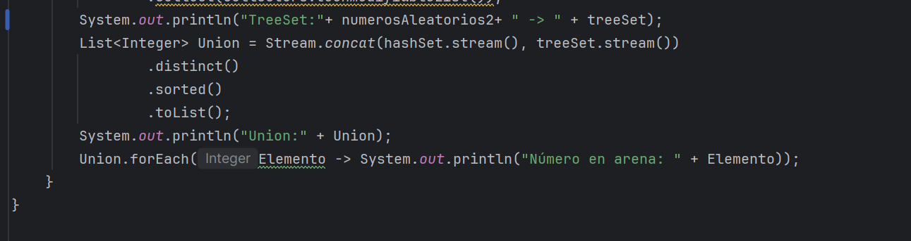

# Maratón Git 2025-2

**Integrantes:**
- Oscar andres Sanchez porras
- Santiago Suarez

**Nombre de la rama:** feature/SanchezOscar_SuarezSantiago_2025-2

---

## Retos Completados

### Reto 1: Configuración y creación de rama
**Evidencia:**

Descripción breve de lo que hicieron:  

Configuramos el correo institucional en Git, creamos la rama desde `develop` y confirmamos que se reflejó en el repositorio remoto.

---

### Reto 2: Commit colaborativo
**Evidencia:**

Descripción breve de lo que hicieron:  
Ambos integrantes realizamos cambios para practicar commits colaborativos y resolver conflictos en Git.

---
### Reto 3: Commit colaborativo
**Evidencia:**

Descripción breve de lo que hicieron:  

Se hicieron 2 ramas, una para implementar el mensaje builder que repite tres veces el mensaje y otra para implementar el mensaje buffer que invierte el mensaje. Luego se
combinaron las ramas y se creó un método que implementa los dos mensajes en uno.

---

### Reto 5: Commit colaborativo
**Evidencia:**

Descripción breve de lo que hicieron:  

Se crean dos ramas HashSet donde la lista descarta números que son múltiplos de 3 y otra rama TreeSet donde descarta números que son múltiplos de 5, luego se crea otra lista donde se unen las listas TreeSet y HastSet sin números repetidos y se imprime cada elemento de la lista recorriéndolo.
---