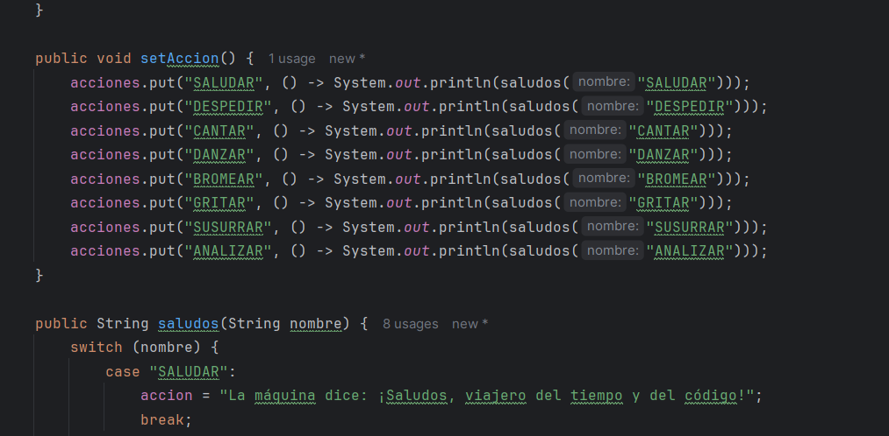

# Maratón Git 2025-2

**Integrantes:**
- Oscar andres Sanchez porras
- Santiago Suarez

**Nombre de la rama:** feature/SanchezOscar_SuarezSantiago_2025-2

---

## Retos Completados

### Reto 1: Configuración y creación de rama
**Evidencia:**

<h4>Descripción breve de lo que hicieron:  
</h4>

Configuramos el correo institucional en Git, creamos la rama desde `develop` y confirmamos que se reflejó en el repositorio remoto.

---

### Reto 2: Commit colaborativo
**Evidencia:**

.png)
.png)
.png)

<h4>Descripción breve de lo que hicieron:  
</h4>
Ambos integrantes realizamos cambios para practicar commits colaborativos y resolver conflictos en Git.
Se lograron resolver problemas en merge para combinar ramas
y se aprendieron nuevos metodos de los streams para resolver el problema

---
### Reto 3: Commit colaborativo
**Evidencia:**

<h4>Descripción breve de lo que hicieron:  
</h4>
Se hicieron 2 ramas, una para implementar el mensaje builder que repite tres veces el mensaje y otra para implementar el mensaje buffer que invierte el mensaje. Luego se
combinaron las ramas y se creó un método que implementa los dos mensajes en uno.

---
### RETO #4: El tesoro de las Llaves duplicadas
**Evidencia**

<h4>Descripción breve de lo que hicieron:  
</h4>
Se crearon ramas creando hash, y se solucionaron problemas con el merge.
Se soluciono el problema gracias a los metodos del stream y sus colecciones.
Se decicio crear una clase mapa del tesoro para los metodos de este y en la clase reto 4 
se crean los mapas respectivos. 

---
### Reto 5: Commit colaborativo
**Evidencia:**

<h4>Descripción breve de lo que hicieron:  
</h4>

Se crean dos ramas HashSet donde la lista descarta números que son múltiplos de 3 y otra rama TreeSet donde descarta números que son múltiplos de 5, luego se crea otra lista donde se unen las listas TreeSet y HastSet sin números repetidos y se imprime cada elemento de la lista recorriéndolo.

---
### Retp 6: La máquina de decisiones

**Evidencia:**

<h4>Descripción breve de lo que hicieron:  
</h4>
Se usa un switch para cada accion dependiendo de su nombre y se llama un metodo que usa la interfaz runable para llamar el metodo desigando
---

### PARTE 3 – Cuestionario:

<h4>1.	Cuál es la diferencia entre git merge y git rebase</h4>

  La diferencia es que git merge une el historial de una rama origen a una rama destino.
  Y git rebase reescribe el historial de una rama origen a una rama destino unificando las ramas mientras que el otro mantiene las ramas independientes

<h4>2. Si dos ramas modifican la misma línea de un archivo ¿Qué sucede al hacer merge?</h4>
  Ocurre un conflicto que no se puede resolver de forma automatica

<h4>3. ¿Cómo puedes ver gráficamente el historial de merges y ramas en consola?</h4>
  git log --oneline --graph –all
  git log permite observa el historial de los commits utilizados por las ramas
   --oneline → muestra cada commit en una sola línea (más compacto).
   --graph → dibuja un gráfico ASCII de las ramas y merges.
   --all → muestra todas las ramas, no solo la actual.

<h4>4. Explica la diferencia entre un commit y un push</h4>
  El commit guarda cambios localmente mientras  que el push envia los cambios guardados al repositorio remoto

<h4>5. ¿Para qué sirve git stash y git stash pop?</h4>

  Git stash sirve para guardar las configuraciones temporalmente. Esto es útil para cuando hay conflictos entre repositorio remoto y local.
  Git stash pop recupera los archivos guardados en stash y los aplica en la rama.

<h4>6. ¿Qué diferencia hay entre HashMap y HashTable?</h4>
  Ambos son estructuras de datos pero lo que los hace principalmente distitnos son:
  •	 Rendimiento: donde el Hashmap supera al Hashtable
  •	 Sincronizacion: El hashtable es sincronizado y ademas es thread-safe
  •	 Clave Null: El hashmap si permite

<h4>7. ¿Qué ventajas tiene Collectors.toMap() frente a un bucle tradicional para llenar un mapa?</h4>
  •	Más declarativo y conciso: en un ciclo for tiene un estilo imperativo mientras que este es mas directo en obtener no que se requiere.
  •	Mejor legibilidad
  •	Permite definir qué hacer con claves duplicadas.
  •	Se integra fácilmente con filter, map, sorted en Streams.
  •	Permite elegir la implementación del Map (HashMap, TreeMap, etc.).

<h4>8. Si usas List con objetos y luego aplicas stream().map() ¿Qué tipo de operación estás haciendo?</h4>
  Se transforman los objetos en la lista con la funcion que este en el map pero devuelve un nuevo stream con estos nuevos objetos
  no modifica los originales ademas de necesitar una operacion terminal para que se active el stream

<h4>9. ¿Qué hace el método stream().filter() y qué retorna?</h4>
  Lo que hace es filtrar n elementos de una colección mediante una condición.
  Esta retorna otro stream con los elementos que hayan pasado el filtro.

<h4>10. Describe el paso a paso de cómo crear una rama desde develop si es una funcionalidad nueva.</h4>
   • Clonar el repositorio en local con git clone
   • Sicronizar el repositorio con git pull
   • Cambiarse a develop con git checkout develop
   • Actualizar con git pull origin develop
   • Poner el comando: git checkout -b feature/rama para crear la rama y tambien ir a esta de una vez
   • Despues se puede hacer un push para subir la rama al repositorio remoto

<h4>11. ¿Cuál es la diferencia entre crear una rama con git branch y con git checkout -b?</h4>
  Git Branch crea la rama pero no se mueve a ella inicialmente se queda en la rama donde se creo la otra rama, mientras que checkout crea la rama pero se mueve directamente a ella.

<h4>12. ¿Por qué es recomendable crear ramas feature/ para nuevas funcionalidades en lugar de trabajar en main directamente?</h4>
   • Proteccion al codigo principal/proyecto
   • Mas eficiente el trabajo en equipo debido que cada participante puede editar sin interrupir
   • Historial de cambios y se puede revertir un cambio sin afectar todo el proyecto 
