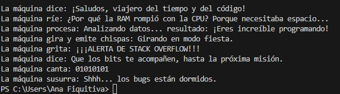

# Laboratorio-CVDS-DOSW-01

# Maratón Git 2025-2

**Integrantes:**
- Diego Fernando Chavarro
- Ana Gabriela Fiquitiva

**Nombre de la rama:** feature/ChavarroDiego_FiquitivaAna-2025-2

---

## Retos Completados

### Reto 1: La bienvenida

**Evidencia:**

Creamos la rama feature/reto_numero_1_ChavarroDiego_FiquitivaAna_2025-2 a partir de nuestra rama principal feature/ChavarroDiego_FiquitivaAna_2025-2. En esta rama implementamos la clase Estudiante con los atributos nombre, edad, correo y semestre, y la clase MensajeBienvenida encargada de construir el saludo utilizando stream(), map() y collect() sobre una lista de estudiantes (List). Finalmente, en Reto1.java instanciamos los dos estudiantes de la pareja y generamos el mensaje de bienvenida, que se imprime en consola.

### Reto 2: Carrera en paralelo

**Evidencia:**

---

### Reto 3: El eco misterioso

**Evidencia:**

Para este reto partimos desde la rama `feature/reto3_ChavarroDiego_FiquitivaAna_2025-2`.  
- **Estudiante A** creó la rama `feature/reto3_builder_ChavarroDiego_FiquitivaAna_2025-2`, donde implementó un método que repite un mensaje 3 veces usando **StringBuilder** y **stream()** para las repeticiones.  
- **Estudiante B** creó la rama `feature/reto3_buffer_ChavarroDiego_FiquitivaAna_2025-2`, donde implementó un método que invierte un mensaje usando **StringBuffer**.  
- En el **primer choque**, ambos crearon la misma función `ecoMisterioso(String msg)`, que combina ambas transformaciones: repetir el mensaje 3 veces y luego invertirlo. Al unir cambios se produjo un conflicto de merge, el cual resolvimos integrando ambas soluciones en un solo método.  
- La solución final utiliza **expresiones lambda** para invocar la función y cumplir los requisitos de seguridad en hilos y velocidad.  

---

### Reto 4: El tesoro de las Llaves duplicadas

**Evidencia:**

Este reto se centró en la colaboración y resolución de conflictos al fusionar dos implementaciones de mapas, una usando `HashMap` y otra usando `Hashtable`. 

El primer estudiante implementó un método que almacena pares clave-valor en un `HashMap`, ignorando claves duplicadas. El segundo estudiante hizo lo mismo, pero con un `Hashtable` sincronizado. Ambas ramas fueron fusionadas, resolviendo un conflicto para priorizar los valores del `Hashtable`. Finalmente, una función unificada combina ambos mapas, prioriza los valores del `Hashtable`, convierte las claves a mayúsculas y las ordena alfabéticamente antes de imprimir, utilizando `stream()`, `map()` y `sorted()`.

---

### Reto 5: Batalla de Conjuntos

**Evidencia:**

Este desafío involucró la colaboración para manipular y combinar colecciones de tipo `Set`. Cada integrante creó una rama individual para implementar un método: uno usó un **`HashSet`** para almacenar números aleatorios y eliminar los múltiplos de 3, mientras que el otro utilizó un **`TreeSet`** para almacenar números en orden y eliminar los múltiplos de 5. Las ramas fueron fusionadas, resolviendo los conflictos para combinar ambas colecciones en una única estructura ordenada. La solución final utilizó un **`TreeSet`** para asegurar que los números estuvieran ordenados y sin duplicados, y se emplearon **`stream()`** y **`filter()`** para procesar las colecciones y eliminar elementos, imprimiendo el resultado final con expresiones lambda.

---
### Reto 6: La maquina de desiciones

Este reto se centró en la creación de un sistema de comandos interactivo en Java. Cada integrante del equipo implementó un conjunto de comandos en una rama separada usando la estructura switch-case. Posteriormente, las ramas fueron fusionadas para unificar los fragmentos de código. La solución final consolidó todos los comandos en una estructura **`Map<String, Runnable>`** que vincula cada comando (clave String) con una acción específica (valor Runnable) usando expresiones lambda. Esto permitió un manejo flexible y escalable de los comandos, donde cada acción se ejecutaba al llamar al método run(), demostrando una solución final cohesiva y funcional.

---
