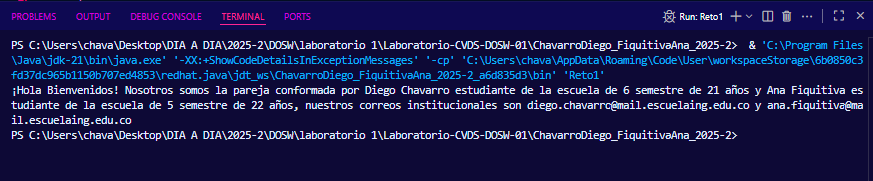

# Laboratorio-CVDS-DOSW-01

# Maratón Git 2025-2

**Integrantes:**
- Diego Fernando Chavarro
- Ana Gabriela Fiquitiva

**Nombre de la rama:** feature/ChavarroDiego_FiquitivaAna-2025-2

---

## Retos Completados

### Reto 1: La bienvenida

**Evidencia:**

Creamos la rama feature/reto_numero_1_ChavarroDiego_FiquitivaAna_2025-2 a partir de nuestra rama principal feature/ChavarroDiego_FiquitivaAna_2025-2. En esta rama implementamos la clase Estudiante con los atributos nombre, edad, correo y semestre, y la clase MensajeBienvenida encargada de construir el saludo utilizando stream(), map() y collect() sobre una lista de estudiantes (List). Finalmente, en Reto1.java instanciamos los dos estudiantes de la pareja y generamos el mensaje de bienvenida, que se imprime en consola.

### Reto 2: Carrera en paralelo

**Evidencia:**

---

### Reto 4: El tesoro de las Llaves duplicadas

**Evidencia:**

Este reto se centró en la colaboración y resolución de conflictos al fusionar dos implementaciones de mapas, una usando `HashMap` y otra usando `Hashtable`. 

El primer estudiante implementó un método que almacena pares clave-valor en un `HashMap`, ignorando claves duplicadas. El segundo estudiante hizo lo mismo, pero con un `Hashtable` sincronizado. Ambas ramas fueron fusionadas, resolviendo un conflicto para priorizar los valores del `Hashtable`. Finalmente, una función unificada combina ambos mapas, prioriza los valores del `Hashtable`, convierte las claves a mayúsculas y las ordena alfabéticamente antes de imprimir, utilizando `stream()`, `map()` y `sorted()`.

