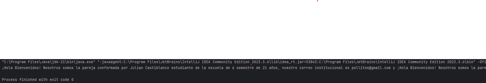

# Maratón Git 2025-2

**Integrantes**
- Julian Castiblanco Real
- Juan Carlos Leal Cruz

**Problemas Encontrados**

Julian tuvo un problema con IntelliJ debido a que la carpeta del repositorio constantemente desaparecía y luego al volver a clonar el respositorio no era posible ver la rama que creamos como equipo.

**feature/CatiblancoJualian_LealJuan_2025-2**

---

## Retos Completados

### Reto 1:
***Evidencia***

En la imagen se observa el reto 1 finalizado, para ello lo que hicimos fue crear dos clases super sencillas que son Estudiante y Mensaje. En estudiante pusimos todos los datos que se necesitan para el problema junto con sus respectivos getters y setters al igual que un toString() para entregar el texto en un formato en específico. En la clase de Mensaje creamos un método main para poder ejecutar y una lista donde almancenar a los estudiantes de tal manera que luego usando stream imprimimos el mensaje.

### Reto 2:
***Evidencia***
