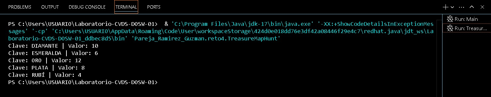
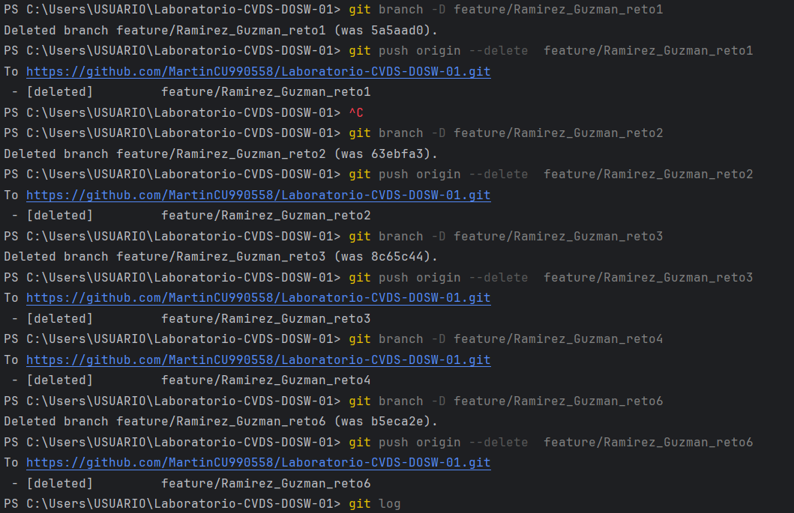

# Maratón Git 2025 - 2

- Deisy Lorena Guzmán Cabrales
- Julián Santiago Ramírez Urueña

feature/RamirezJulian_GuzmanDeisy_2025-2

## Retos Completados

### Reto 1: 
Se creó la rama independiente 'feature/Ramirez_Guzman_reto1' para 
trabajar en el reto y, a la vez, evitar posibles conflictos con 
los demás grupos.

### Reto 2:
Se implementó una labor similar con el reto numero dos. Usando
una rama independiente para solucionar el problema propuesto.

### Reto 4:
Mismo caso de rama independiente. 

### Reto 6:
Ejerciendo una rama independiente (de nuevo) para el reto se
concretó la solución requerida.

### NOTA EN RELACIÓN A LOS AJUSTES POSTERIORES A LA ENTREGA:

- Después de un llamado de atención dirigido por el profesor Andrés Cantor
se nos recomendó una implementación mucho más organizada, en pro de mantener un flujo
de trabajo en equipo mayormente limpio y superior.
Razón por la cual, se decidió dejar todo lo  trabajado en la rama principal correspondiente 
a nuestro grupo de trabajo.

## Cuestionario Conceptual

1. ¿Cuál es la diferencia entre git merge y git rebase?
Por un lado, 'git merge' fusiona los commits para combinar una rama 
con otra manteniendo el historial original de cada una. En cambio, 
'git rebase' cumple una función similar, pero, reescribe el historial 
de los commits en la rama destino; es decir, hace parecer que sólamente
se trabajó allí.

2. Si dos ramas modifican la misma línea de un archivo. ¿Qué pasará al hacer merge?
Se presentará un choque o conflicto de modo que, como se está trabajando 
de forma independiente en una misma área, Git "no sabrá" qué versión del 
archivo conservar. Es necesario resolver el conflicto mencionado de forma 
manual.

3. ¿Cómo puedes ver el historial de merges y ramas en consola?
Con el comando git log, especificando según lo necesario.

4. ¿Diferencia entre un commit y un push? 
Git commit se encarga del repositorio local mientras que git push, está al mando del 
repositorio remoto. Sin embargo, es importante destacar que se tiene que ejecutar git 
commit para poder luego, ejecutar git push.

5. ¿Para que sirve git stash y git pop?
...

6. ¿Diferencias entre HashMap y HashTable?
"HashTable es sincronizado y seguro para subprocesos multihilo, mientras que HashMap es 
más rápido para entornos de únicamente un proceso.