# Maratón Git 2025-2

**Integrantes:**
- Oscar andres Sanchez porras
- Santiago Suarez

**Nombre de la rama:** feature/SanchezOscar_SuarezSantiago_2025-2

---

## Retos Completados

### Reto 1: Configuración y creación de rama
**Evidencia:**
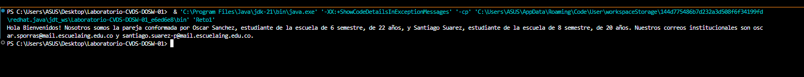

<h4>Descripción breve de lo que hicieron:  
</h4>

Configuramos el correo institucional en Git, creamos la rama desde `develop` y confirmamos que se reflejó en el repositorio remoto.

---

### Reto 2: Commit colaborativo
**Evidencia:**

<h4>Descripción breve de lo que hicieron:  
</h4>
Ambos integrantes realizamos cambios para practicar commits colaborativos y resolver conflictos en Git.
Se lograron resolver problemas en merge para combinar ramas
y se aprendio un nuevo metodo de los streams para resolver el problema

---
### Reto 3: Commit colaborativo
**Evidencia:**
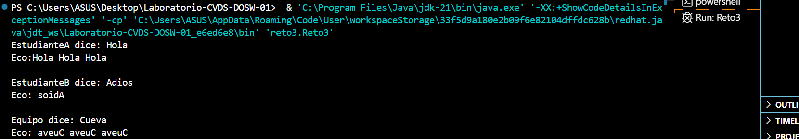
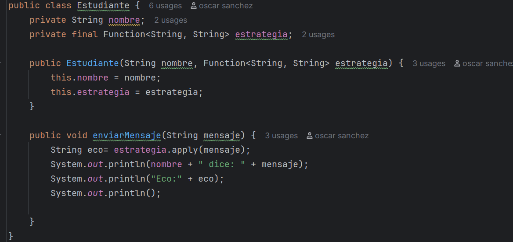
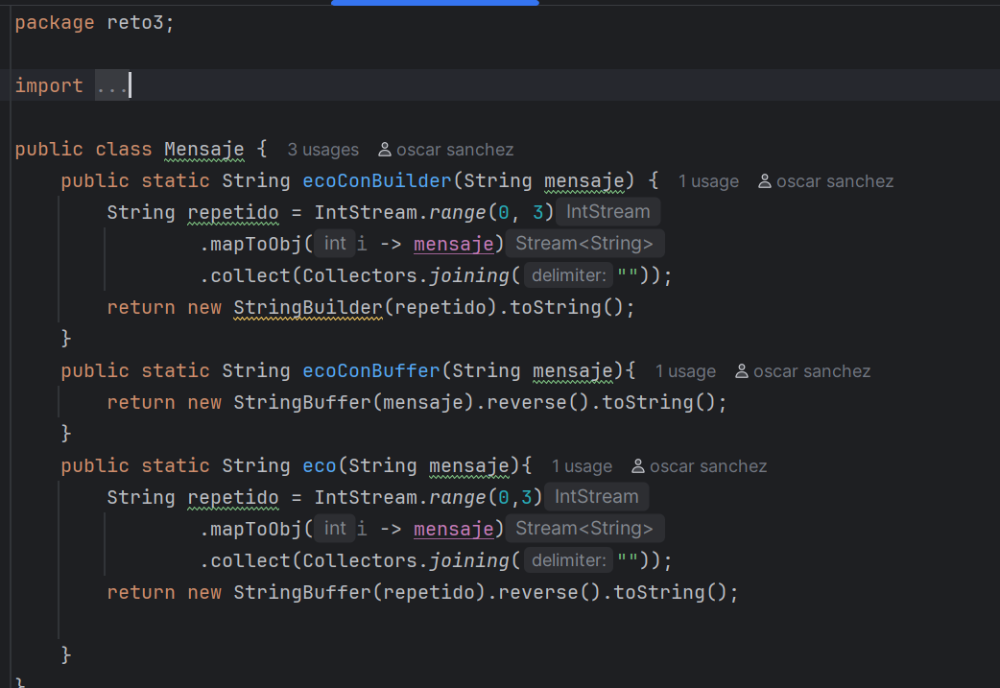
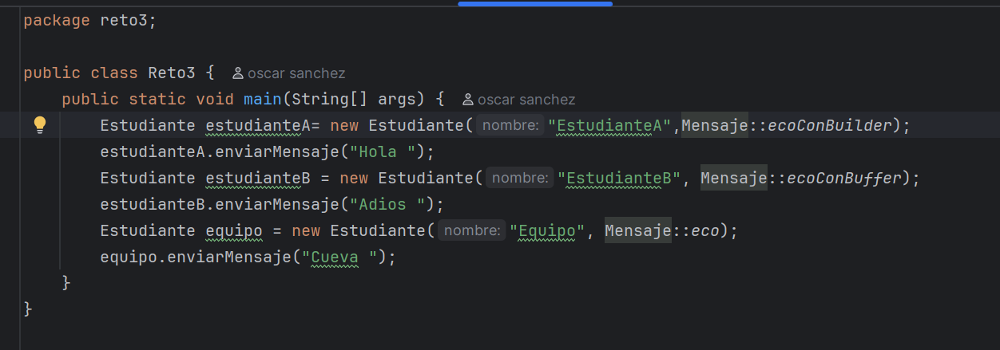

<h4>Descripción breve de lo que hicieron:  
</h4>
Se hicieron 2 ramas, una para implementar el mensaje builder que repite tres veces el mensaje y otra para implementar el mensaje buffer que invierte el mensaje. Luego se
combinaron las ramas y se creó un método que implementa los dos mensajes en uno.

---
### RETO #4: El tesoro de las Llaves duplicadas
**Evidencia**

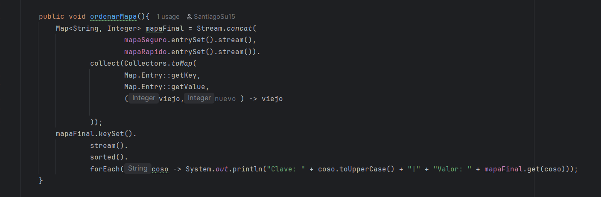
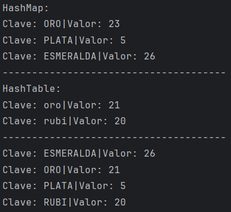

<h4>Descripción breve de lo que hicieron:  
</h4>
Se crearon ramas creando hash, y se solucionaron problemas con el merge.
Se soluciono el problema gracias a los metodos del stream y sus colecciones.
Se decicio crear una clase mapa del tesoro para los metodos de este y en la clase reto 4 
se crean los mapas respectivos. 

---
### Reto 5: Commit colaborativo
**Evidencia:**
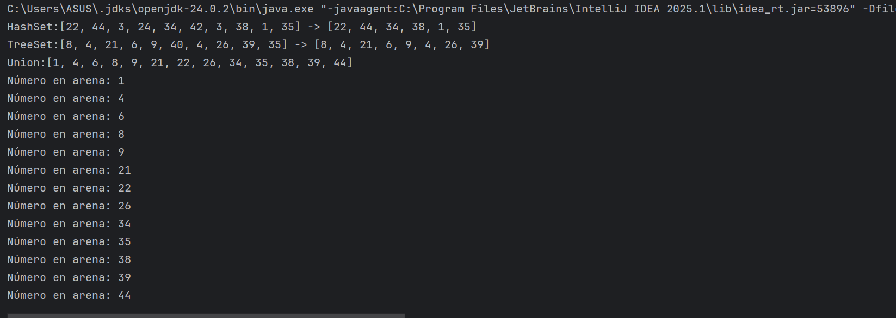
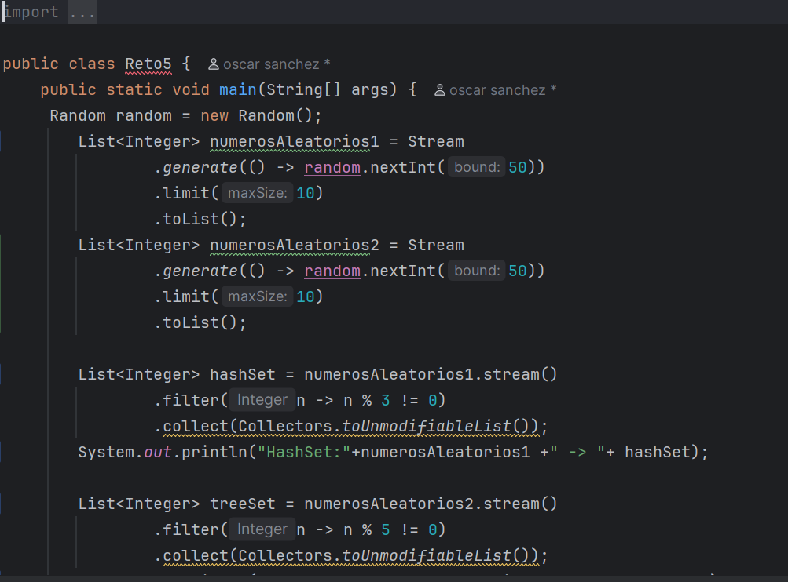
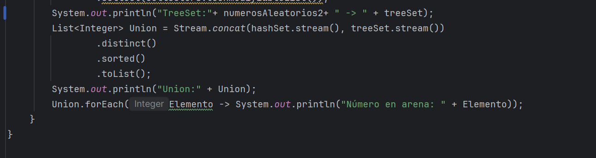

<h4>Descripción breve de lo que hicieron:  
</h4>

Se crean dos ramas HashSet donde la lista descarta números que son múltiplos de 3 y otra rama TreeSet donde descarta números que son múltiplos de 5, luego se crea otra lista donde se unen las listas TreeSet y HastSet sin números repetidos y se imprime cada elemento de la lista recorriéndolo.

---
### Retp 6: La máquina de decisiones

**Evidencia:**
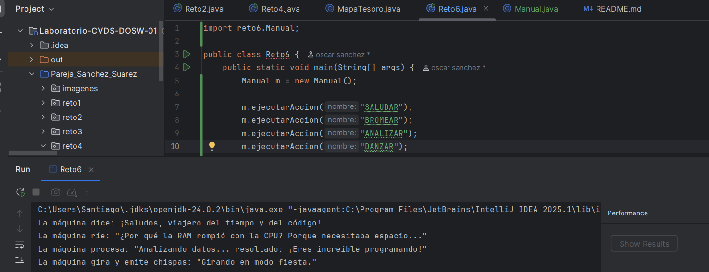
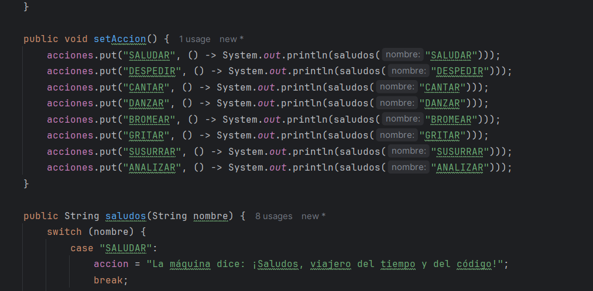

<h4>Descripción breve de lo que hicieron:  
</h4>
Se usa un switch para cada accion dependiendo de su nombre y se llama un metodo que usa la interfaz runable para llamar el metodo desigando